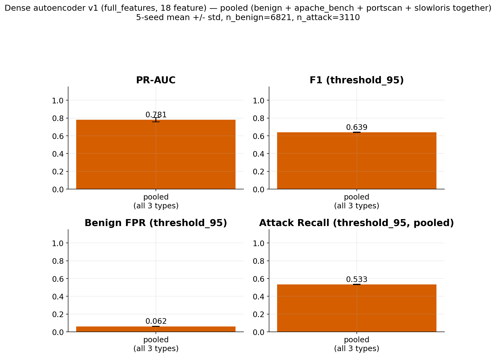

# Dense autoencoder — v1 (18 feature), notebook sonuçları

Kaynak: `phase3_dense/phase3_dense_autoencoder.ipynb` (çalıştırılmış output'lardan çıkarıldı, notebook dosyasının kendisi kopyalanmadı — bkz. `04_model_notebooks/dense_v1.ipynb`).

Data: train=23274 (tamamı benign), val=6576, test=6581. `full_features`: 18 kolon, `no_conn_state`: 14 kolon (conn_state one-hot'ları çıkarılmış ablation varyantı).

Mimari: `Input(N) -> Dense(16, relu, L2) -> Dropout(0.15) -> Dense(8, relu, L2, bottleneck) -> Dropout(0.15) -> Dense(16, relu, L2) -> Dense(N, linear)`.

## Deneysel tek çalıştırma (seed=0, full_features)

Final train_loss: 0.0458, final val_loss: 0.0342 (bkz. `01_loss_curve_demo_run.png`).

## 5-seed sweep — full_features vs. no_conn_state

| seed | variant | test_auc | precision (pctl95) | recall (pctl95) | f1 (pctl95) |
|---|---|---|---|---|---|
| 0 | full_features | 0.9479 | 0.9322 | 0.8014 | 0.8618 |
| 1 | full_features | 0.9390 | 0.9619 | 0.7956 | 0.8709 |
| 2 | full_features | 0.9304 | 0.9276 | 0.8014 | 0.8599 |
| 3 | full_features | 0.9575 | 0.9083 | 0.8014 | 0.8515 |
| 4 | full_features | 0.9568 | 0.9466 | 0.8014 | 0.8680 |
| 0 | no_conn_state | 0.9356 | 0.9023 | 0.7956 | 0.8456 |
| 1 | no_conn_state | 0.9141 | 0.9793 | 0.7956 | 0.8779 |
| 2 | no_conn_state | 0.9538 | 0.9398 | 0.7956 | 0.8617 |
| 3 | no_conn_state | 0.9354 | 0.9588 | 0.7956 | 0.8696 |
| 4 | no_conn_state | 0.9318 | 0.9498 | 0.7956 | 0.8659 |

### 5-seed mean ± std

| variant | n_features | test_auc | precision | recall | f1 |
|---|---|---|---|---|---|
| full_features | 18 | 0.9463 ± 0.0104 | 0.9353 ± 0.0181 | 0.8002 ± 0.0023 | 0.8624 ± 0.0068 |
| no_conn_state | 14 | 0.9341 ± 0.0126 | 0.9460 ± 0.0255 | 0.7956 ± 0.0000 | 0.8641 ± 0.0107 |

## Reconstruction error (test, seed=0, full_features)

Benign test error: mean=0.02420, median=0.00721. Attack test error: mean=5273.49561, median=287.25766 (bkz. `02_reconstruction_error_histogram.png`).

## ROC (test, seed=0, full_features)

Test AUC = 0.9479 (bkz. `03_roc_curve.png`).

## Ablation: full_features vs. no_conn_state (5-seed mean)

AUC delta (full - no_conn_state): +0.0122. F1 delta (full - no_conn_state): -0.0017 (bkz. `04_ablation_full_vs_no_conn_state.png`).

## Özet tablo (notebook'un kendi Bölüm 9'undan)

| Model | Precision | Recall | F1 | Test AUC |
|---|---|---|---|---|
| Naive baseline (`conn_state != SF`) | 0.9908 | 0.6656 | 0.7963 | — |
| Autoencoder — full_features (pctl95, 5-seed mean) | 0.9353 | 0.8002 | 0.8624 | 0.9463 |

## Attack-type 4-panel summary

## Pooled (all attack types together) summary

Ayrı ayrı attack-type kırılımı yerine, benign + apache_bench + portscan + slowloris
hepsi AYNI koşuda birlikte değerlendirilmiş (test_with_attack_type.csv, pooled,
n_benign=6821, n_attack=3110), 5-seed mean +/- std:

| metric | pooled mean +/- std |
|---|---|
| ROC-AUC | 0.8542 +/- 0.0338 |
| PR-AUC | 0.7807 +/- 0.0246 |
| F1 (thr95) | 0.6390 +/- 0.0041 |
| benign FPR (thr95) | 0.0615 +/- 0.0020 |
| attack recall (thr95, pooled) | 0.5329 +/- 0.0031 |

