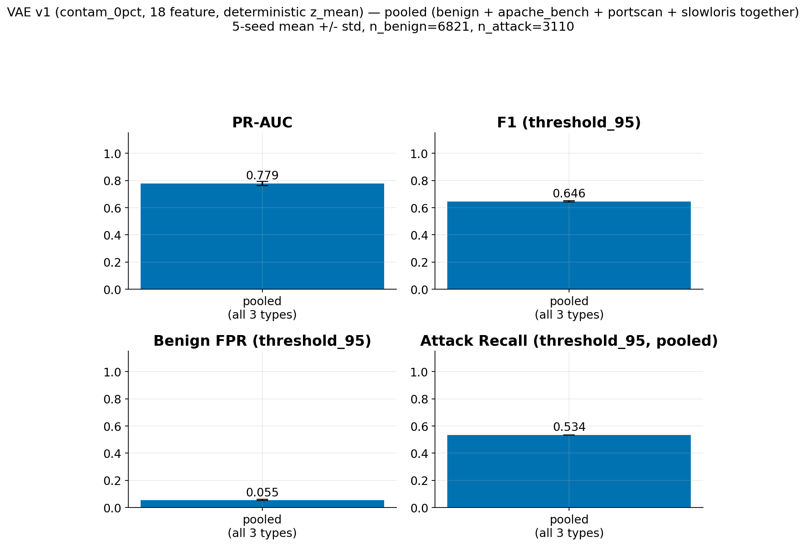

# VAE — v1 (18 feature), notebook sonuçları

Kaynak: `phase3_vae/phase3_vae_autoencoder.ipynb` (çalıştırılmış output'lardan çıkarıldı, notebook dosyasının kendisi kopyalanmadı — bkz. `04_model_notebooks/vae_v1.ipynb`).

**Önemli not:** Bu notebook, final raporun (07_final_written_report) temel aldığı 5-seed `contam_0pct` kanonik değerlendirmeyle **aynı çalıştırma değil** — bu, mimari/hiperparametre seçimini yapan bir "health-check" + latent-dim/beta seçim notebook'u (tek seed, seçim sürecinin kendisi). Aşağıdaki sayılar bu seçim sürecinin sonuçlarıdır, final rapordaki `threshold_95` / 5-seed / deterministic z_mean tablolarıyla karıştırılmamalıdır.

Data: train (window_10, %100 benign) = 4356, val = 6576 (4609 benign, 1967 attack), test = 6581 (4678 benign, 1903 attack). `INPUT_DIM = 18`.

Mimari: encoder `Dense(16, relu) -> Dropout(0.1) -> Dense(8, relu) -> [z_mean, z_log_var]`, reparameterization trick, simetrik decoder `Dense(8, relu) -> Dense(16, relu) -> Dense(18, linear)`.

## 1. Latent-dimension sweep (6 / 8 / 10)

| latent_dim | val_auc | val_recon_loss | val_kl_loss | epochs | time (s) |
|---|---|---|---|---|---|
| 6 | 0.7215 | 3.0305 | 1.3453 | 59 | 6.7 |
| 8 | 0.7203 | 1.4004 | 1.1105 | 196 | 19.1 |
| 10 | 0.8014 | 5.9707 | 0.3737 | 171 | 18.1 |

**Seçim mantığı:** en küçük latent (6) baz alınır; latent=8 toleransın (0.01) altında kalınca reddedilir; latent=10, +0.0799 AUC kazancıyla toleransı aştığı için seçilir → **latent_dim = 10**.

## 2. Loss eğrileri + KL collapse kontrolü (seçilen model, latent=10, beta=1.0)

Son 34 epoch'ta ortalama train KL loss: 0.271505 (bkz. `01_loss_curves_kl_collapse_check.png`). z_mean per-dim std çoğunlukla ~0.02-0.11 aralığında — kısmi posterior collapse belirtisi (10 boyuttan sadece 1-2'si aktif).

## 3. Threshold kalibrasyonu (val)

threshold (val benign pctl95) = 0.46198. threshold (val Youden's J) = 0.08155.

## 4. Test değerlendirmesi (latent=10, beta=1.0 baseline)

TEST AUC = 0.9243 (bkz. `02_test_evaluation_roc_and_histogram.png`).

| threshold | precision | recall | f1 | accuracy |
|---|---|---|---|---|
| pctl95 (0.46198) | 0.8828 | 0.7956 | 0.8369 | 0.9103 |
| Youden's J (0.08155) | 0.5157 | 0.9995 | 0.6804 | 0.7285 |

## 5. Posterior collapse düzeltmesi — beta/annealing varyant karşılaştırması (latent=10 sabit)

| variant | val_auc | active_dims (train) | active_dims (val) | final_recon_loss | final_kl_loss | epochs |
|---|---|---|---|---|---|---|
| beta=1.0 (baseline) | 0.8014 | 1/10 | 2 | 5.9707 | 0.3737 | 171 |
| beta=0.5 | 0.7228 | 6/10 | 6 | 2.5689 | 2.0919 | 83 |
| beta=0.25 | 0.8432 | 3/10 | 3 | 0.6452 | 2.7419 | 200 |
| KL-annealing (sigmoid → 1.0) | 0.7251 | 10/10 | 10 | 2.9378 | 2.4111 | 21 |

Loss eğrileri (recon + KL), 4 varyant yan yana: bkz. `03_loss_curves_beta_variants_comparison.png`.

**Seçim mantığı (val_auc bazlı, tolerans=0.03):**
- beta=0.5: AUC düşüşü 0.0786 > tolerans → **reddedildi**.
- beta=0.25: AUC düşüşü -0.0418 (aslında iyileşme) ≤ tolerans, active_dims=3/10 > baseline'ın 1'i → **kazandı**.
- KL-annealing: AUC düşüşü 0.0763 > tolerans → **reddedildi**.

→ **Seçilen varyant: beta=0.25** (active_dims=3/10, val_AUC=0.8432).

## 6. Final tek-seferlik test değerlendirmesi (seçilen varyant: beta=0.25)

TEST AUC = 0.9372. TEST F1 (pctl95 threshold, val'den) = 0.8413.

## 7. 5-seed pooled sonuç (kullanıcı isteği üzerine eklendi)

Bölüm 4-6'daki tek-seed sayılar, mimari seçim sürecinin (latent-dim/beta sweep) bir yan
ürünüydü. Burada aynı 5 seed (0-4), kanonik `contam_0pct` model ağırlıkları (18 feature,
v1) ve deterministik z_mean skorlama ile 5-seed ortalama sonuç var -- bu,
`01_single_attack_type/vae/results.md`'deki 20-seed attack-type-bazlı tablonun pooled/5-seed
karşılığı, aynı `test_with_attack_type.csv` (9931 satır: benign + portscan + apache_bench +
slowloris, resampled pencereler dahil) test kümesi üzerinden.

**Not — model ağırlıkları arşivden yüklendi:** Canlı `phase3_vae/05_contamination_sweep/
04_models/contam_0pct/` klasörü v2 retrain'i tarafından yerinde (in-place) üzerine
yazılmış (artık 19-feature ağırlıkları içeriyor, input_shape=(None,19)); gerçek v1
(18-feature) ağırlıkları sadece `V1_ARCHIVE/phase3_vae/.../contam_0pct/` altında hâlâ
duruyor, bu tablo oradan yüklendi.

**Not — Bölüm 4-6'nın "TEST AUC" sayısıyla doğrudan kıyaslanamaz:** Bölüm 4-6, orijinal
phase3_vae notebook'unun kendi `window_10` train/val/test split'ini kullanıyordu; bu
bölüm ise `06_attack_type_analysis/test_with_attack_type.csv`'nin (Dense v1 karşılaştırma
altyapısının kullandığı, resampled pencereleri de içeren, 9931 satırlık) test kümesini
kullanıyor -- farklı bir test popülasyonu. Dense v1 notebook'unun 5-seed pooled sayısıyla
(`../dense_v1/results.md`, test_auc=0.9463) da bu yüzden birebir aynı popülasyon değil;
en doğru dense-vae v1 kıyası attack-type bazında yapılan karşılaştırmadır (bkz.
`01_single_attack_type/{dense_v1,vae}/results.md`).

| metric | 5-seed mean +/- std |
|---|---|
| ROC-AUC | 0.8541 +/- 0.0184 |
| PR-AUC | 0.7787 +/- 0.0154 |
| F1 (thr95) | 0.6459 +/- 0.0039 |
| benign FPR (thr95) | 0.0549 +/- 0.0045 |
| attack recall (thr95, pooled) | 0.5344 +/- 0.0000 |

n_benign=6821, n_attack=3110 (test_with_attack_type.csv, pooled). Pooled recall düşük
çünkü apache_bench (n=1487, kendi recall'u ~0.026) tüm pooled attack'ların ~%48'ini
oluşturuyor ve ortalamayı aşağı çekiyor -- portscan/slowloris tek başına ~1.0 recall'da
(bkz. `01_single_attack_type/vae/results.md`).

ROC (mean-of-5-seed error): bkz. `04_roc_curve_5seed.png`. Reconstruction error histogramı
(mean-of-5-seed error): bkz. `05_reconstruction_error_histogram_5seed.png`.

## Attack-type 4-panel summary

## Pooled (all attack types together) summary

Ayrı ayrı attack-type kırılımı yerine, benign + apache_bench + portscan + slowloris
hepsi AYNI koşuda birlikte değerlendirilmiş (test_with_attack_type.csv, pooled,
n_benign=6821, n_attack=3110), 5-seed mean +/- std:

| metric | pooled mean +/- std |
|---|---|
| ROC-AUC | 0.8541 +/- 0.0184 |
| PR-AUC | 0.7787 +/- 0.0154 |
| F1 (thr95) | 0.6459 +/- 0.0039 |
| benign FPR (thr95) | 0.0549 +/- 0.0045 |
| attack recall (thr95, pooled) | 0.5344 +/- 0.0000 |

