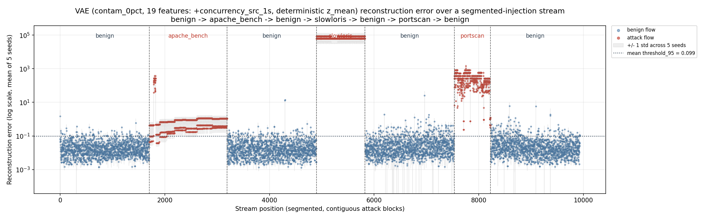
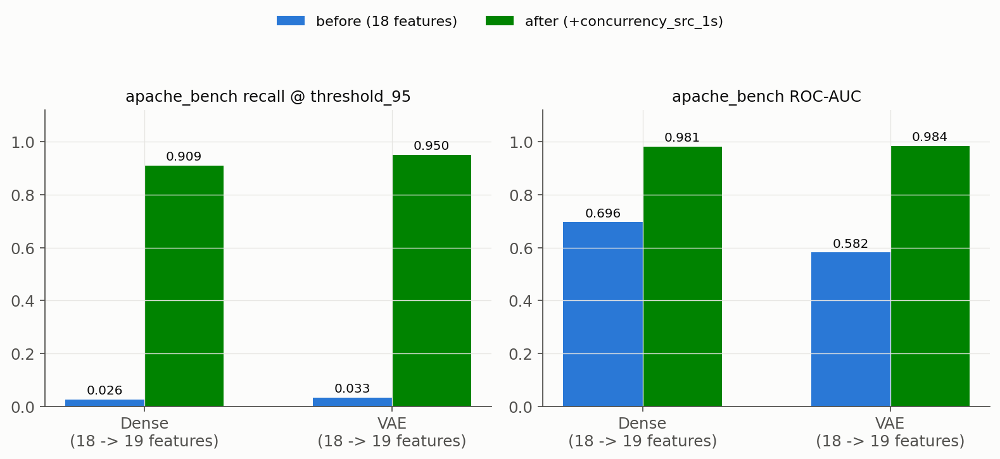

# Attack-Type Analysis — VAE and Dense Autoencoder, Canonical Model (19 Features)

*Technical report — prepared for Gérard*

*Scope: `06_attack_type_analysis/`, `11_pairwise_segmented_v2/`, `09_dense_v2_comparison/`, `10_vae_v2_comparison/`, `14_concurrency_feature_experiment/`*

## 1. Context and Objectives

This report documents the current canonical anomaly-detection pipeline: a
VAE and a Dense autoencoder, both trained on **19 modeling features** — the
original 18 (packet/byte/duration statistics, protocol/service/conn-state
one-hots) plus one new feature, `concurrency_src_1s`, added on 2026-07-30
after an investigation into why one attack type was being missed. There is
no v1/v2 split in this report: every number below is the current model.
The prior 18-feature results are archived in full at `V1_ARCHIVE/` for
anyone who needs the before/after comparison; this document reports the
current state directly.

Three evaluation protocols are used throughout, identical for both models:

1. **Single attack-type**: each attack type evaluated against the full
   benign test pool, the other two types excluded from that run.
2. **Pairwise**: each of the 3 attack-type pairs evaluated against benign,
   the third type excluded — includes a *decomposed* (per-constituent-type)
   recall to separate "recall moves because the mix changed" from "recall
   moves because the model's behavior on that type changed."
3. **Segmented (contiguous-block) injection**: the same test flows,
   reordered into one stream — benign → apache_bench → benign → slowloris →
   benign → portscan → benign — to check whether contiguous placement
   (vs. shuffled) changes per-flow outcomes.

`threshold_95` (95th percentile of reconstruction error on held-out
benign-only validation flows, recalibrated per seed) is the operating
point for recall/F1/FPR throughout. VAE scoring is **deterministic**
(z = z_mean, no reparameterization noise — see the Methodology Note).

---

## 2. VAE Model Results

Model: `phase3_vae/05_contamination_sweep/04_models/contam_0pct`, 5 seeds,
19 features, deterministic z_mean scoring.

### 2.1 Single attack-type

| attack_type | n_attack | ROC-AUC | PR-AUC | F1 (thr95) | Benign FPR (thr95) | Attack Recall (thr95) |
|---|---|---|---|---|---|---|
| apache_bench | 1487 | 0.9836 ± 0.0123 | 0.9035 ± 0.0805 | 0.8428 ± 0.0337 | 0.0664 ± 0.0110 | **0.9500 ± 0.0453** |
| portscan | 694 | 0.9998 ± 0.0001 | 0.9983 | 0.7551 | 0.0664 ± 0.0110 | 1.0000 ± 0.0000 |
| slowloris | 929 | 1.0000 ± 0.0000 | 1.0000 | 0.8048 | 0.0664 ± 0.0110 | 1.0000 ± 0.0000 |

*(source: `10_vae_v2_comparison/results_single_attack_type_vae_v2.csv/.md`)*

### 2.2 Pairwise combinations

| Pair | n_attack | ROC-AUC | PR-AUC | F1 (thr95) | Pooled Recall (thr95) |
|---|---|---|---|---|---|
| portscan + apache_bench | 2181 | 0.9887 ± 0.0084 | 0.9641 | 0.8888 | 0.9659 ± 0.0309 |
| portscan + slowloris | 1623 | 0.9999 ± 0.0000 | 0.9997 | 0.8779 | 1.0000 ± 0.0000 |
| apache_bench + slowloris | 2416 | 0.9899 ± 0.0076 | 0.9715 | 0.8989 | 0.9692 ± 0.0279 |

**Decomposed apache_bench-only recall** (the same per-flow flag decision,
isolated to apache_bench flows regardless of what else is in the eval set):
solo = 0.9500 ± 0.0453; paired with portscan = 0.9500 ± 0.0453; paired with
slowloris = 0.9500 ± 0.0453 — **identical up to seed noise in all three
settings**, confirming the pooled-recall increase in the table above is a
mixing artifact (adding well-detected portscan/slowloris flows pulls the
pooled number up), not an actual change in how apache_bench is detected.

*(source: `11_pairwise_segmented_v2/vae/results.md`)*

### 2.3 Segmented (contiguous-block) injection

*Figure 1 — Reconstruction error (log scale, mean of 5 seeds) vs. stream
position. Dashed vertical lines mark segment boundaries; the dotted
horizontal line is the mean threshold_95 (0.0987). All three attack blocks
now sit visibly above the benign band.*

| Segment | n | Benign FPR (thr95) | Attack Recall (thr95) | F1 (thr95) | Recall in shuffled test (ref.) |
|---|---|---|---|---|---|
| benign (seg. 0) | 1705 | 0.0386 ± 0.0166 | — | — | — |
| apache_bench | 1487 | — | 0.9500 ± 0.0453 | 0.9739 ± 0.0242 | 0.9500 ± 0.0453 |
| benign (seg. 2) | 1705 | 0.0490 ± 0.0191 | — | — | — |
| slowloris | 929 | — | 1.0000 ± 0.0000 | 1.0000 ± 0.0000 | 1.0000 ± 0.0000 |
| benign (seg. 4) | 1705 | 0.0967 ± 0.0097 | — | — | — |
| portscan | 694 | — | 1.0000 ± 0.0000 | 1.0000 ± 0.0000 | 1.0000 ± 0.0000 |
| benign (seg. 6) | 1706 | 0.0811 ± 0.0117 | — | — | — |

Block recall matches the shuffled-test-set number exactly for every type —
consistent with a static per-flow threshold decision with no sequence
memory. Benign FPR ranges 0.0386–0.0967 across the 4 gaps (a modest-n
sampling spread around the pooled 0.0664 average, not a drift effect).

*(source: `11_pairwise_segmented_v2/vae/block_recall_f1.md`)*

---

## 3. Dense Model Results

Model: `phase3_dense/04_phase3_models/full_features`, 5 seeds, 19 features.

### 3.1 Single attack-type

| attack_type | n_attack | ROC-AUC | PR-AUC | F1 (thr95) | Benign FPR (thr95) | Attack Recall (thr95) |
|---|---|---|---|---|---|---|
| apache_bench | 1487 | 0.9808 ± 0.0076 | 0.8930 | 0.8218 | 0.0660 ± 0.0036 | **0.9092 ± 0.0382** |
| portscan | 694 | 0.9997 ± 0.0002 | 0.9973 | 0.7551 | 0.0660 ± 0.0036 | 1.0000 ± 0.0000 |
| slowloris | 929 | 1.0000 ± 0.0000 | 1.0000 | 0.8050 | 0.0660 ± 0.0036 | 1.0000 ± 0.0000 |

*(source: `09_dense_v2_comparison/results_single_attack_type_dense_v2.csv/.md`)*

### 3.2 Pairwise combinations

| Pair | n_attack | ROC-AUC | PR-AUC | F1 (thr95) | Pooled Recall (thr95) |
|---|---|---|---|---|---|
| portscan + apache_bench | 2181 | 0.9868 ± 0.0052 | 0.9587 | 0.8747 | 0.9381 ± 0.0261 |
| portscan + slowloris | 1623 | 0.9999 ± 0.0001 | 0.9995 | 0.8782 | 1.0000 ± 0.0000 |
| apache_bench + slowloris | 2416 | 0.9882 ± 0.0046 | 0.9672 | 0.8862 | 0.9441 ± 0.0235 |

**Decomposed apache_bench-only recall**: solo = 0.9092 ± 0.0382; paired with
portscan = 0.9092 ± 0.0382; paired with slowloris = 0.9092 ± 0.0382 — same
invariance confirmed on the second architecture.

*(source: `11_pairwise_segmented_v2/dense_v2/results.md`)*

### 3.3 Segmented (contiguous-block) injection

*Figure 2 — Same stream as Figure 1, evaluated with the Dense autoencoder.
Mean threshold_95 = 0.1256.*

| Segment | n | Benign FPR (thr95) | Attack Recall (thr95) | F1 (thr95) | Recall in shuffled test (ref.) |
|---|---|---|---|---|---|
| benign (seg. 0) | 1705 | 0.0151 ± 0.0027 | — | — | — |
| apache_bench | 1487 | — | 0.9092 ± 0.0382 | 0.9521 ± 0.0211 | 0.9092 ± 0.0382 |
| benign (seg. 2) | 1705 | 0.0142 ± 0.0061 | — | — | — |
| slowloris | 929 | — | 1.0000 ± 0.0000 | 1.0000 ± 0.0000 | 1.0000 ± 0.0000 |
| benign (seg. 4) | 1705 | 0.1478 ± 0.0051 | — | — | — |
| portscan | 694 | — | 1.0000 ± 0.0000 | 1.0000 ± 0.0000 | 1.0000 ± 0.0000 |
| benign (seg. 6) | 1706 | 0.0870 ± 0.0063 | — | — | — |

*(source: `11_pairwise_segmented_v2/dense_v2/block_recall_f1.md`)*

### 3.4 Both architectures agree

apache_bench recall is now 0.91–0.95 depending on architecture (previously
2.6–3.3%), and the effect is consistent across every protocol tested
(single, pairwise-decomposed, segmented) and across two architectures
trained on genuinely different data (Dense: windows 01–08, 23,274 benign
train flows; VAE: window_10 only, 3,049 benign train flows). This
consistency is itself evidence that the fix addresses a *feature-space*
limitation rather than an architecture- or training-data-specific quirk
(see Section 4).

*Figure 3 — apache_bench recall and ROC-AUC, 18-feature (before) vs.
19-feature (after), both architectures.*

---

## 4. Root Cause Analysis

### 4.1 Why apache_bench was originally missed

apache_bench (`ab`) fires many near-identical short HTTP GET requests. At
the single-flow level, each of those requests is an ordinary, unremarkable
short HTTP connection — it does not look anomalous on its own. Diagnostic
work (Kolmogorov-Smirnov separability + mean-shift analysis on the original
18 features, full detail in `V1_ARCHIVE/10_final_report/
04_apache_bench_diagnostics/findings.md`) showed why this defeated
reconstruction-error-based detection specifically:

- The best individual features (`orig_pkts_scaled`, `orig_bytes_scaled`,
  etc.) had **high KS statistics (0.62–0.76)** against benign — on paper,
  separable.
- But their **mean shift was only 0.4–0.7 benign standard deviations** —
  i.e., apache_bench's cluster sits *inside* the normal range of benign
  traffic, not in its tail. The high KS came from apache_bench forming a
  very narrow, low-variance cluster (a stereotyped, repeated request),
  which produces a sharp empirical-CDF jump even when the cluster's center
  is unremarkable.
- Reconstruction error sums squared per-feature deviations from a
  benign-fit manifold. A point sitting inside the training distribution's
  normal range reconstructs cleanly **regardless of how sharply its CDF
  differs from benign's** — which is exactly what happened: the typical
  apache_bench flow's reconstruction error was close to the typical
  benign flow's, and both models flagged only a small, fixed subset of
  apache_bench flows (2.6–3.3% recall).

By contrast, portscan and slowloris push their best features tens to
hundreds of benign standard deviations away (near-categorical splits,
e.g. `conn_state=REJ`, extreme `byte_ratio`) — obviously anomalous at the
single-flow level, which is why both models already detected them at
≥98.8% recall under the 18-feature model.

### 4.2 What was actually missing, and the fix

What makes apache_bench anomalous is not any single request's shape — it's
that the **same request repeats far more often, with far less inter-arrival
variance, than organic traffic**. That is a property of the *local request
rate*, invisible to a model that scores one flow at a time against 18
purely per-flow features.

The fix, `concurrency_src_1s`: for each flow, the count of other flows from
the **same source IP** arriving within ±1 second (log1p-transformed,
standardized on the benign-train split only — same leakage-free convention
as every other feature). This is purely temporal/volumetric and contains
no hardcoded IP value anywhere in its computation. Adding this single
19th feature is what produced the recall jump documented in Sections 2–3.

### 4.3 Generalization caveat

This lab dataset has exactly one attacker IP and a small number of benign
hosts. `concurrency_src_1s` is IP-agnostic by construction (it groups by
whatever source IP a flow actually has, not a hardcoded value), but the
dataset itself cannot distinguish "high per-source request rate is
inherently suspicious" from "high per-source request rate happens to
correlate with the one IP that is the attacker here." Knock-out ablation
in `14_concurrency_feature_experiment/` (freezing the feature to its
benign-train mean at inference time, same trained weights) confirmed the
recall gain collapses back to the 18-feature baseline — the model is
genuinely using this feature, not something else correlated with it — but
that check cannot rule out the dataset-composition caveat above. Before
generalizing this result to a deployment with many legitimate high-rate
clients (e.g., NAT'd traffic, load balancers, legitimate bursty clients),
the feature's benign false-positive behavior should be validated in a
multi-source-IP setting.

---

## 5. Methodology Note — How the Right Feature Was Found

The path to `concurrency_src_1s` was not direct, and the detour is worth
recording briefly. The first hypothesis tested (`13_temporal_feature_experiment/`)
was **inter-arrival time relative to the single previous flow** from the
same source IP — motivated by an early diagnostic finding that apache_bench's
median IAT was ~2364× shorter than benign's. Retraining with that feature
**did not move recall at all** (KS = 0.375 on the full dataset, weaker than
the existing best features), and exposed that the original 2364× figure was
itself a measurement artifact of computing IAT over a sparse test subset
rather than the full flow history. The feature that actually worked,
tested next (`14_concurrency_feature_experiment/`), was a **local window
count** rather than a single-previous-flow gap — the two are related but
not equivalent, and only the windowed version captured the signal
strongly enough to move detection. Full negative and positive results,
including a knock-out ablation and a dataset-composition confound found
and corrected along the way, are archived in both experiment folders and
summarized in `V1_ARCHIVE/README.md`.

---

## 6. Known Limitation

**The O3 dedup-prevalence correction has not yet been applied to the
current (19-feature) PR-AUC/F1 numbers.** The prior 18-feature report
applied a correction (recomputing PR-AUC/F1 on a deduplicated test set,
since the resampled windows — `window_resampled_15pct/20pct` — repeat real
flows and distort prevalence) after confirming ROC-AUC/recall/FPR are
behavior metrics unaffected by it (<0.02 difference, see
`V1_ARCHIVE/10_final_report/01_single_attack_type/vae/dedup_sanity_check/`).
That correction has not been re-run on the current model. **ROC-AUC,
recall, and FPR figures in this report are unaffected**; the PR-AUC/F1
numbers above should be read as provisional until the correction is
reapplied — this is flagged as a follow-up item, not a known error.

---

## 7. Supplementary Notes (carried forward, still valid)

**VAE latent-dimension note.** The VAE's bottleneck (8 units) is narrower
than its nominal latent dimension (10), so `z_mean` cannot carry more than
8 effective degrees of freedom regardless of the declared latent size. A
dedicated ablation (`phase3_vae/05_contamination_sweep/12_latent_ablation/`,
run on the 18-feature model) found latent=8 and latent=10 statistically
indistinguishable on detection metrics — an architectural imprecision
without measurable effect on any number reported here.

**Threshold calibration note.** `threshold_95` is estimated from a small
held-out benign validation set (653 flows for the VAE, 4,609 for Dense) —
a tail percentile with real sampling noise. Prior analysis
(`10_final_report/06_scripts/o4_threshold_transfer/`, run on the
18-feature model) found threshold_95 varies with CV≈28% across VAE seeds,
and the val→test FPR transfer carries a small systematic upward bias
(realized ≈5.8% vs. 5.0% nominal). This affects the threshold-dependent
operating point (recall/F1/FPR); ROC-AUC/PR-AUC are unaffected.

**Threat-model note.** Throughout this project, `is_attack` is defined by
source-IP identity (`id.orig_h == <attacker IP>`), not by flow behavior.
Both models therefore learn "the statistical signature of traffic from the
attacking machine," not a behavior-based notion of maliciousness. Scenarios
where that equivalence breaks — IP spoofing, NAT'd or shared-source traffic
mixing legitimate and malicious flows, lateral movement from a previously
trusted host — are not covered by this evaluation and are not tested.

---

## 8. Conclusion

1. **The apache_bench detection gap is closed.** Recall rose from 2.6–3.3%
   to 90.9–95.0% (Dense / VAE respectively), ROC-AUC from 0.58–0.70 to
   0.98+, with a small benign-FPR cost (+0.4 to +0.5 percentage points on
   average). portscan and slowloris remain at ≥99.8% recall, unaffected.
2. **The fix is a feature-space fix, not a model fix.** Two architectures
   trained on disjoint data (different windows, ~7.6× different training-set
   size) show the same magnitude of improvement from the same single added
   feature — the strongest evidence available that the original 18-feature
   set, not either architecture, was the limiting factor.
3. **The improvement is robust across evaluation protocols.** Decomposed
   pairwise recall and segmented (contiguous-block) recall both match the
   shuffled single-attack-type number exactly, for both models — the
   detection behavior is a stable per-flow property, not an artifact of how
   the test set happens to be assembled.
4. **Two things remain open**, tracked explicitly rather than silently
   assumed resolved: the O3 dedup-prevalence correction has not been
   reapplied to PR-AUC/F1 (Section 6), and `concurrency_src_1s`'s
   generalization to multi-attacker or high-legitimate-rate environments is
   untested on this single-attacker-IP dataset (Section 4.3).
