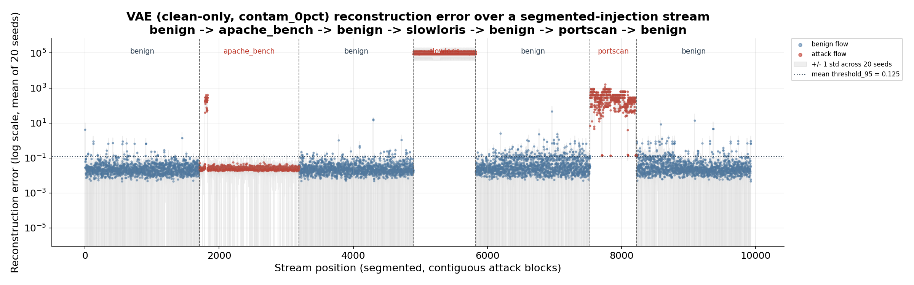
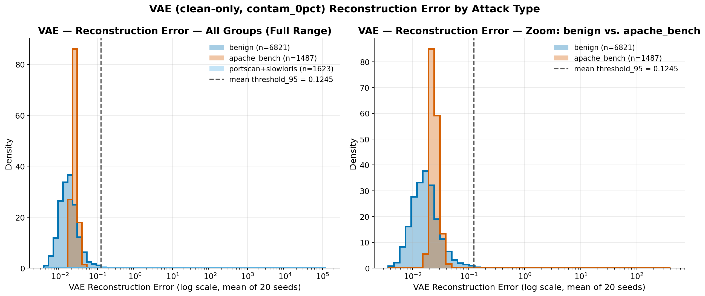

# Analyse par type d'attaque — VAE clean-only vs Dense autoencoder v1

*Rapport technique — préparé pour Gérard*

*Périmètre : `06_attack_type_analysis/`, `07_segmented_injection/`, `08_dense_v1_comparison/`*

## 1. Contexte et objectifs

Le suivi de vendredi a identifié 4 tâches, toutes en **inference-only**
(aucun réentraînement de modèle) sur les modèles déjà entraînés
(VAE clean-only `contam_0pct`, 20 seeds ; Dense autoencoder v1
`full_features`, 5 seeds) :

1. **Dériver un label attack_type** (portscan / apache_bench / slowloris)
   par flow dans le test set, alors que le pipeline ne produisait jusqu'ici
   qu'un label binaire `is_attack`, et **casser la métrique binaire agrégée**
   en performance par type d'attaque individuel.
2. Étendre cette analyse aux **combinaisons par paires** de types d'attaque,
   pour vérifier si un type mal détecté (apache_bench) devient plus facile
   à détecter quand il partage l'ensemble d'évaluation avec un type bien
   détecté.
3. Construire une **expérience d'injection segmentée** : au lieu du test set
   mélangé habituel, réordonner les mêmes flows en blocs contigus par type
   d'attaque (benign → apache_bench → benign → slowloris → benign →
   portscan → benign), pour visualiser le score de reconstruction en
   fonction de la position dans le flux et vérifier si le comportement du
   modèle change à la frontière d'un bloc.
4. **Répéter les 3 analyses précédentes avec le Dense autoencoder v1**
   (au lieu du VAE) pour déterminer si la faiblesse observée sur
   apache_bench est spécifique à l'architecture VAE ou si elle est partagée.

Aucune des données originales (`test_with_attack_type.csv`,
`segmented_sequence.csv`, modèles `.keras`) n'a été modifiée entre les
étapes — chaque script réutilise les fonctions du script précédent
(`evaluate_group()`, `assemble_labeled_features_df()`,
`compute_error_matrix()`, `run_segmented_evaluation()`) via un objet
`backend` paramétrable (VAE ou Dense), sans dupliquer la logique de
chargement de modèle / seuil / calcul de métriques.

**Dérivation du label attack_type.** `test_with_attack_type.csv` est
construit par jointure entre `03_phase3_splits/test_indices.csv` et les
logs d'orchestration (`ground_truth/attack_log.csv`, un log cumulatif par
fenêtre de capture, filtré à l'intervalle propre de chaque fenêtre) sur la
clé `(window_id, ts)`. Pour les fenêtres rééchantillonnées
(`window_resampled_15pct/20pct`, ~31% des flows d'attaque du test set), qui
n'ont pas leur propre `attack_log.csv` mais conservent le `ts` d'origine du
flow source, la correspondance est faite **globalement** sur `ts` (tolérance
1s) plutôt que par `window_id` — les fenêtres réelles ne se chevauchant
jamais dans le temps, cette approche résout correctement 100% des 3110 flows
d'attaque du test set (taux de correspondance vérifié).

---

## 2. Performance par type d'attaque (analyse individuelle)

**Protocole.** Pour chaque type d'attaque, l'ensemble d'évaluation est :
tous les flows benign du test set + uniquement les flows de ce type
(les 2 autres types sont exclus de cette exécution). Seuil = `threshold_95`
(95ᵉ percentile de l'erreur de reconstruction sur les flows benign de
validation), calculé par seed. Moyenne ± écart-type sur 20 seeds (VAE).

| attack_type | n_attack | ROC-AUC | PR-AUC | F1 (thr95) | Benign FPR (thr95) | Attack Recall (thr95) |
|---|---|---|---|---|---|---|
| apache_bench | 1487 | 0.5815 ± 0.0768 | 0.2133 ± 0.0219 | 0.0507 ± 0.0081 | 0.0565 ± 0.0059 | **0.0328 ± 0.0055** |
| portscan | 694 | 0.9982 ± 0.0005 | 0.9886 ± 0.0023 | 0.7737 ± 0.0161 | 0.0578 ± 0.0056 | 0.9889 ± 0.0138 |
| slowloris | 929 | 1.0000 ± 0.0000 | 1.0000 ± 0.0000 | 0.8271 ± 0.0158 | 0.0570 ± 0.0062 | 1.0000 ± 0.0000 |

*(source : `06_attack_type_analysis/results_single_attack_type.csv/.md`)*

### Constat principal

**apache_bench n'est quasiment jamais détecté** : recall = 3.3%, F1 = 0.051,
ROC-AUC = 0.58 (à peine mieux que le hasard). À l'inverse, portscan et
slowloris sont détectés quasi parfaitement (recall ≥ 0.99, ROC-AUC ≥ 0.998).

### Pourquoi la métrique binaire agrégée masque ce problème

Le test set contient 1487 flows apache_bench, 694 portscan et 929 slowloris
— soit apache_bench = 47.8% des flows d'attaque, mais la métrique binaire
`is_attack` habituelle (recall/F1 agrégé, voir par ex. les métriques Phase 3
existantes) mélange les 3 types dans un seul chiffre. Comme portscan et
slowloris sont détectés à ~99-100%, ils tirent la moyenne globale vers le
haut : un recall binaire global proche de 65-70% (cohérent avec les
résultats historiques du contamination sweep, voir
`phase3_vae/05_contamination_sweep/README.md`) peut coexister avec un type
d'attaque presque totalement manqué. Sans décomposition par attack_type,
cette faiblesse structurelle n'apparaît dans aucun rapport agrégé — d'où
l'intérêt de cette analyse.

**Cause probable (feature-level).** apache_bench (`ab.exe`, requête HTTP
fixe de 80 octets, `conn_state=SF`, durée < 1s) produit un flow qui
ressemble, dans l'espace des 18 colonnes de features actuelles, à du trafic
HTTP benign ordinaire — contrairement à portscan (ports non-HTTP,
`conn_state` distinctif) et slowloris (connexion maintenue ouverte
30s+, `conn_state=RSTO/S1`), qui ont une signature bien plus éloignée du
comportement benign appris par les deux autoencodeurs.

---

## 3. Performance par paires de types d'attaque

**Protocole.** Pour chaque paire, l'ensemble d'évaluation est : tous les
flows benign + les flows des 2 types de la paire (le 3ᵉ type est exclu).
Mêmes modèle/seuil que la section 2.

| Paire | n_attack | ROC-AUC | PR-AUC | F1 (thr95) | Recall poolé (thr95) |
|---|---|---|---|---|---|
| portscan + apache_bench | 2181 | 0.7135 ± 0.0527 | 0.5598 ± 0.0232 | 0.4447 ± 0.0070 | 0.3369 ± 0.0061 |
| portscan + slowloris | 1623 | 0.9993 ± 0.0002 | 0.9975 ± 0.0007 | 0.8905 ± 0.0105 | 0.9953 ± 0.0057 |
| apache_bench + slowloris | 2416 | 0.7427 ± 0.0474 | 0.6283 ± 0.0219 | 0.5170 ± 0.0054 | 0.4044 ± 0.0029 |

*(source : `06_attack_type_analysis/results_pairwise_attack_type.csv/.md`)*

### Recall poolé vs. recall décomposé — une distinction essentielle

Le recall "poolé" ci-dessus mélange les 2 types de la paire : il **augmente
mécaniquement** dès qu'un type bien détecté (portscan ou slowloris) est
ajouté à apache_bench, même si le comportement du modèle sur les flows
apache_bench eux-mêmes ne change pas. Le seuil et le modèle étant fixes, la
décision de flagger un flow ne dépend jamais des autres flows présents dans
le set d'évaluation — c'est une propriété structurelle des deux
autoencodeurs testés (décision statique par flow, sans mémoire de
séquence).

Pour vérifier cela empiriquement, le recall a été **décomposé par
sous-type** à l'intérieur de chaque paire :

| Ensemble d'évaluation | Recall poolé (paire) | Recall apache_bench seul (décomposé) |
|---|---|---|
| apache_bench (solo) | — | 0.0328 ± 0.0055 |
| portscan + apache_bench (paire) | 0.3369 ± 0.0061 | 0.0324 ± 0.0050 |
| apache_bench + slowloris (paire) | 0.4044 ± 0.0029 | 0.0322 ± 0.0048 |

*(source : `06_attack_type_analysis/results_combined.md`)*

**Confirmation empirique : le recall d'apache_bench ne change pas
(0.0322-0.0328, à l'intérieur du bruit de seed) qu'il soit évalué seul ou
en présence d'un autre type.** La hausse apparente du recall "poolé" à
33-40% est un artefact du mélange, pas une amélioration réelle de la
détection d'apache_bench — ce point est explicité pour éviter toute
conclusion erronée du type « le pairing améliore la détection
d'apache_bench ».

---

## 4. Expérience d'injection segmentée (blocs contigus)

**Protocole.** Les mêmes flows de `test_with_attack_type.csv` (aucune
donnée synthétique, aucun rééchantillonnage avec remplacement) sont
réordonnés en un flux unique : le pool benign est divisé en 4 segments
quasi égaux, avec un bloc d'attaque contigu inséré entre chaque paire de
segments benign, dans l'ordre configurable
`apache_bench → slowloris → portscan`
(`07_segmented_injection/build_segmented_injection.py`, ordre
paramétrable via `--order`).

*Figure 1 — Erreur de reconstruction (échelle log, moyenne sur 20 seeds) en
fonction de la position dans le flux segmenté. Les lignes verticales
marquent les frontières de segment ; la ligne pointillée horizontale est le
`threshold_95` moyen. Le bloc apache_bench reste visuellement au niveau
benign, alors que slowloris et portscan sautent immédiatement au-dessus du
seuil.*

| Segment | n | Benign FPR (thr95) | Attack Recall (thr95) | F1 (thr95) | Recall test set mélangé (réf.) |
|---|---|---|---|---|---|
| benign (seg. 0) | 1705 | 0.0305 ± 0.0070 | — | — | — |
| apache_bench | 1487 | — | 0.0322 ± 0.0044 | 0.0623 ± 0.0083 | 0.0328 ± 0.0055 |
| benign (seg. 2) | 1705 | 0.0336 ± 0.0078 | — | — | — |
| slowloris | 929 | — | 1.0000 ± 0.0000 | 1.0000 ± 0.0000 | 1.0000 ± 0.0000 |
| benign (seg. 4) | 1705 | 0.0962 ± 0.0222 | — | — | — |
| portscan | 694 | — | 0.9882 ± 0.0148 | 0.9940 ± 0.0075 | 0.9889 ± 0.0138 |
| benign (seg. 6) | 1706 | 0.0696 ± 0.0088 | — | — | — |

*(source : `07_segmented_injection/results_segmented.md`, threshold_95 moyen
= 0.1246)*

### Confirmation : comportement statique, indépendant de l'ordre

Les recalls par bloc (0.0322 / 1.0000 / 0.9882) sont **quasi identiques**
aux recalls du test set mélangé (0.0328 / 1.0000 / 0.9889) — la
différence est du même ordre que le bruit de seed. Ceci confirme
empiriquement que le VAE (comme le Dense autoencoder, voir section 5) est
un détecteur **statique par flow, sans état ni mémoire de séquence** :
qu'une attaque arrive isolée, mélangée à d'autres types, ou en bloc
contigu ne change rien à la décision prise sur un flow donné.

### Note de prudence — fluctuation du Benign FPR entre segments

Le FPR benign varie de **3.05% à 9.62%** selon le segment (vs. 5.75% en
moyenne sur tout le pool benign en un seul bloc). Il serait tentant d'y
lire un effet de "dérive" du modèle au fil du flux, mais **ce n'est
probablement qu'un artefact d'échantillonnage** : chaque segment ne
contient que ~1700 flows, une taille d'échantillon modeste pour un FPR
attendu autour de 5-6% (l'intervalle de confiance à cette taille couvre
largement l'écart observé). Le modèle n'a aucun état porté d'un flow à
l'autre, donc aucun mécanisme plausible de dérive n'existe ici — cette
fluctuation ne doit pas être interprétée sans un rejeu à plus grand n
(segments plus larges, plus de seeds) pour la confirmer ou l'infirmer.

---

## 5. Comparaison VAE vs Dense autoencoder v1

**Protocole.** Les 3 analyses précédentes ont été répétées à l'identique
(mêmes flows, mêmes 18 colonnes de features, même convention
`threshold_95`) sur `phase3_dense/04_phase3_models/full_features`
(5 seeds). Le Dense v1 n'ayant pas de fichier `threshold.json` sauvegardé
par seed, le seuil est recalculé à la volée comme le 95ᵉ percentile de
l'erreur de reconstruction sur les flows benign de validation de
`phase3_dense/03_phase3_splits` — convention reprise telle quelle de
`analysis/attack_type_breakdown_evaluation.py`. Le Dense v1 consomme les
mêmes colonnes `_scaled` que le VAE, sans scaler distinct (confirmé : les
`row_index` de ses propres splits pointent tous dans
`features_all_windows.csv`, sans offset vers les fenêtres
rééchantillonnées).

### Performance individuelle par type

| attack_type | Modèle | ROC-AUC | PR-AUC | F1 (thr95) | Attack Recall (thr95) |
|---|---|---|---|---|---|
| apache_bench | VAE | 0.5815 ± 0.0768 | 0.2133 ± 0.0219 | 0.0507 ± 0.0081 | **0.0328 ± 0.0055** |
| apache_bench | Dense v1 | 0.6957 ± 0.0791 | 0.2704 ± 0.0406 | 0.0401 ± 0.0003 | **0.0262 ± 0.0000** |
| portscan | VAE | 0.9982 ± 0.0005 | 0.9886 ± 0.0023 | 0.7737 ± 0.0161 | 0.9889 ± 0.0138 |
| portscan | Dense v1 | 0.9988 ± 0.0007 | 0.9912 ± 0.0032 | 0.7645 ± 0.0135 | 0.9931 ± 0.0155 |
| slowloris | VAE | 1.0000 ± 0.0000 | 1.0000 ± 0.0000 | 0.8271 ± 0.0158 | 1.0000 ± 0.0000 |
| slowloris | Dense v1 | 1.0000 ± 0.0000 | 1.0000 ± 0.0000 | 0.8157 ± 0.0055 | 1.0000 ± 0.0000 |

*(source : `08_dense_v1_comparison/results_single_attack_type_dense.csv/.md`)*

### Injection segmentée — Dense v1

*Figure 2 — Même flux segmenté que la Figure 1, évalué avec le Dense
autoencoder v1. Le bloc apache_bench forme une ligne quasi plate et
déterministe (écart-type de recall = 0.0000 sur les 5 seeds), contrairement
au nuage plus bruité du VAE (dû à l'échantillonnage stochastique de la
reparamétrisation) — mais le niveau d'erreur reste comparable, bien en
dessous du seuil.*

### Conclusion : la faiblesse sur apache_bench n'est pas spécifique à l'architecture

**Le Dense autoencoder v1 rate apache_bench au moins aussi mal que le VAE**
(recall 2.6% vs 3.3%, F1 0.040 vs 0.051) — sur les 3 protocoles testés
(individuel, paires, segmenté), les deux modèles échouent de façon quasi
identique. Une nuance intéressante : le Dense v1 a un **meilleur pouvoir de
séparation brut** sur apache_bench (ROC-AUC 0.696 vs 0.581, PR-AUC 0.270 vs
0.213) — son score continu ordonne mieux les flows apache_bench par rapport
au benign — mais cet avantage ne se traduit **pas** en meilleure détection
au seuil `threshold_95` réel, chaque modèle étant calibré indépendamment sur
sa propre distribution d'erreur benign.

### Comparaison macro-moyenne (équilibre global entre types)

| Modèle | Recall macro (3 types) | F1 macro (3 types) |
|---|---|---|
| VAE | 0.6739 | 0.5505 |
| Dense v1 | 0.6731 | 0.5401 |

L'écart entre les deux modèles (≤ 0.01) est **plus petit que la variance
inter-seed du VAE lui-même sur apache_bench (std ROC-AUC = 0.077)** — aucun
des deux modèles n'est donc de façon significative plus « équilibré » que
l'autre entre les types d'attaque. Le motif est identique dans les deux
cas : portscan et slowloris quasi parfaits, apache_bench presque
totalement manqué.

*(source complète : `08_dense_v1_comparison/comparison_vae_vs_dense.md`)*

---

## 6. Diagnostic complémentaire — pourquoi apache_bench échappe au VAE

**Protocole.** Pour comprendre *pourquoi* apache_bench n'est pas séparé du
trafic benign (sections 2-5), un diagnostic feature-par-feature a été mené :
test de Kolmogorov-Smirnov (KS) et écart de moyenne (en écarts-types benign)
entre apache_bench et benign sur les 18 colonnes de features scaled, puis un
test d'hypothèse temporelle basé sur le temps inter-arrivée (IAT) entre
flows consécutifs de même label. Aucune donnée modifiée, aucun
réentraînement — inference-only sur le VAE clean-only `contam_0pct`, comme
le reste de ce rapport (source complète :
`10_final_report/04_apache_bench_diagnostics/`).

### 6.1 Séparabilité statistique vs. taille d'effet

| Feature | Groupe | KS stat | Écart moyen (σ benign) |
|---|---|---|---|
| orig_pkts_scaled | volume paquets | 0.755 | -0.44 σ |
| orig_bytes_scaled | volume octets | 0.755 | -0.39 σ |
| resp_bytes_scaled | volume octets | 0.754 | -0.68 σ |
| resp_pkts_scaled | volume paquets | 0.754 | -0.62 σ |
| duration_scaled | durée | 0.693 | -0.42 σ |

*(source : `04_apache_bench_diagnostics/feature_diagnostics_apache_bench.csv`)*

Les statistiques KS sont élevées (0.62-0.76) — sur le papier, apache_bench
semble statistiquement séparable. Mais la colonne « écart moyen » raconte
une autre histoire : le KS est élevé parce qu'apache_bench forme un
**cluster très étroit et à faible variance** (requête HTTP quasi identique
répétée), ce qui crée un saut net dans la CDF empirique — pas parce que ses
valeurs sortent de la plage normale du trafic benign. Son centre ne se situe
qu'à **0.4-0.7 écart-type benign** en moyenne, c'est-à-dire **à l'intérieur**
de la plage normale du trafic benign, pas dans sa queue. L'erreur de
reconstruction étant une somme d'écarts au carré par rapport à une variété
apprise sur le benign, un point situé dans la plage normale de la
distribution d'entraînement se reconstruit proprement, quel que soit
l'écart de sa CDF par rapport à celle du benign.

À titre de comparaison, les features qui séparent fortement portscan et
slowloris du benign (`conn_state_SF`, `byte_ratio_scaled`) déplacent leurs
moyennes de **31 à plus de 1300 écarts-types benign** — un ordre de
grandeur sans commune mesure avec apache_bench.

### 6.2 Confirmation par l'erreur de reconstruction du VAE

*Figure 3 — Distribution de l'erreur de reconstruction (échelle log, moyenne
sur 20 seeds) pour benign, apache_bench et portscan+slowloris combinés.
apache_bench chevauche presque entièrement la distribution benign : à peine
2.6% des flows apache_bench dépassent le seuil moyen `threshold_95` — un
taux même **inférieur** au taux de faux positifs benign lui-même (4.6%,
proche du 5% attendu par construction du seuil). portscan+slowloris, à
l'inverse, en est séparé par plusieurs ordres de grandeur (erreur moyenne ≈
56 900 contre 0.061 pour benign et 5.75 pour apache_bench, 100% des flows
au-dessus du seuil).*

*Figure 4 — Même constat visuellement : les 8 features les plus
discriminantes (par KS) montrent un chevauchement massif des boîtes entre
benign et apache_bench malgré des statistiques KS élevées.*

### 6.3 Hypothèse temporelle : temps inter-arrivée (IAT)

Motivé par le constat de la section 6.1 (apache_bench = requête individuelle
banale, mais répétée), un test rapide et **sans réentraînement** a été
conduit sur une seule feature candidate calculée directement à partir de la
colonne `ts` existante : le temps inter-arrivée (IAT) entre flows
consécutifs de même label, au sein d'une même fenêtre de capture.

*Figure 5 — Distribution du temps inter-arrivée (échelle log). Le médian
apache_bench (0.00092s) est environ **2364× plus court** que le médian
benign (2.18s) — statistique KS = 0.710 (p ≈ 0).*

**Ce résultat nuance, plutôt qu'il ne confirme simplement, l'hypothèse.** Le
KS de l'IAT (0.710) n'est pas supérieur aux meilleures features à un seul
flow de la section 6.1 (jusqu'à 0.755) — donc l'IAT seul n'est pas
statistiquement « meilleur » par ce critère. Ce qui diffère radicalement,
c'est la **taille d'effet** : alors que les features à un seul flow
déplaçaient apache_bench de moins d'un écart-type benign (section 6.1),
l'IAT sépare les deux groupes par **~3 ordres de grandeur** — un signal
d'une nature complètement différente, invisible à un modèle qui ne voit
qu'un flow à la fois.

**Avertissement explicite : ce test est une vérification de séparabilité
statistique uniquement — il n'a PAS été validé par un réentraînement.**
Aucun réentraînement n'a été effectué ; rien ne garantit qu'ajouter cette
feature (ou une variante — taux de requêtes, concurrence) au VAE et le
réentraîner ferait effectivement passer l'erreur de reconstruction
d'apache_bench au-dessus du seuil. Cela nécessiterait un cycle complet
réentraînement + évaluation, explicitement hors périmètre de ce diagnostic.

*(source complète, incl. tableaux de percentiles : `04_apache_bench_diagnostics/findings.md` et `temporal_iat_summary.csv`)*

---

## 7. Conclusion générale

1. **La métrique binaire `is_attack` masque une faiblesse structurelle
   sévère sur apache_bench** (recall 2.6-3.3% selon le modèle), invisible
   dans les rapports agrégés existants car diluée par les 2 autres types
   d'attaque, détectés quasi parfaitement (≥ 98.8% de recall).
2. **Ce recall n'est pas amélioré par la co-présence d'un autre type
   d'attaque** dans l'ensemble d'évaluation (recall décomposé stable à
   ~3.2-3.3% qu'apache_bench soit seul ou en paire) — la hausse du recall
   "poolé" observée en paire est un artefact de mélange de populations, pas
   une amélioration réelle de la détection.
3. **L'ordre d'arrivée des flows (mélangé vs bloc contigu) ne change rien**
   au comportement du modèle — confirmé empiriquement sur le VAE et le
   Dense v1, cohérent avec le fait que les deux sont des détecteurs
   statiques par flow, sans mémoire de séquence.
4. **La faiblesse sur apache_bench est partagée par le VAE et le Dense
   autoencoder v1** — deux architectures différentes échouent de façon
   quasi identique, ce qui pointe vers une **limite du jeu de 18 features
   actuel** plutôt qu'un défaut d'un modèle en particulier. Changer
   d'architecture d'autoencodeur ne résoudra probablement pas ce problème
   seul.

### Pistes pour la suite

- **Feature engineering ciblé sur la signature apache_bench** — le
  diagnostic de la section 6 apporte un premier élément de preuve
  statistique en faveur de cette piste : le temps inter-arrivée entre
  requêtes apache_bench consécutives est ~2364× plus court que pour le
  benign (section 6.3), un signal d'une taille d'effet largement supérieure
  à tout ce qu'offrent les 18 features actuelles. Une feature de type
  timing inter-requêtes / taux de requêtes par IP source sur une fenêtre
  glissante / concurrence par destination reste néanmoins **une hypothèse
  non validée par réentraînement** — la prochaine étape logique est un
  cycle complet ajout-de-feature + réentraînement + réévaluation pour
  confirmer qu'elle fait effectivement franchir le seuil de détection à
  apache_bench, et pas seulement qu'elle sépare statistiquement les deux
  populations.
- **Seuil ou modèle spécifique par type d'attaque** (approche ensembliste)
  plutôt qu'un seuil unique global — étant donné que portscan et slowloris
  sont déjà quasi résolus, un second détecteur/seuil dédié à la signature
  HTTP courte pourrait cibler spécifiquement apache_bench sans dégrader les
  2 autres types.
- **Élargir le rééchantillonnage benign par segment** avant de tirer des
  conclusions sur la fluctuation du FPR observée en section 4 (3-9.6%) —
  vérifier si elle persiste à un n plus grand par segment.
