# NIDS Projesi — Attack-Type Analizi, Segmented Injection ve apache_bench Kök Neden Analizi

**Kapsamlı Teknik Dokümantasyon**

*Kapsam: `06_attack_type_analysis/`, `07_segmented_injection/`, `08_dense_v1_comparison/`, `10_final_report/04_apache_bench_diagnostics/`*

*Tarih: 28 Temmuz 2026*

---

## 0. Giriş

### 0.1 Cuma toplantısında (27 Temmuz 2026) belirlenen 4 görev

Bu dokümantasyonun kapsadığı tüm çalışma, 27 Temmuz 2026 Cuma günü yapılan
toplantıda belirlenen 4 görevin sonucudur. Görevlerin hepsi **inference-only**
olarak tanımlanmıştır — yani hiçbir modelin yeniden eğitilmesi (retrain)
söz konusu değildir; sadece daha önce eğitilmiş modeller üzerinde
değerlendirme (evaluation) yapılmıştır:

1. **attack_type label'ının türetilmesi** — pipeline'ın o ana kadar ürettiği
   tek şey ikili (binary) bir `is_attack` etiketiydi. Bu görev, test setindeki
   her saldırı flow'una hangi saldırı tipine (portscan / apache_bench /
   slowloris) ait olduğunu gösteren bir `attack_type` sütunu eklemeyi ve
   toplu (agregat) ikili metriği, tek tek saldırı tiplerine göre kırılmış
   performansa "bölmeyi" hedefliyordu.
2. **İkili (pairwise) kombinasyon analizi** — kötü tespit edilen bir tipin
   (apache_bench), iyi tespit edilen bir tiple (portscan veya slowloris)
   aynı değerlendirme setinde bulunduğunda daha kolay tespit edilip
   edilmediğini test etmek.
3. **Bloklu (segmented) enjeksiyon deneyi** — aynı test flow'larını karışık
   sırada değil, her saldırı tipinin tek bir bitişik (contiguous) blok
   halinde göründüğü bir sıraya yeniden dizmek, ve reconstruction error'ın
   pozisyona göre nasıl değiştiğini görselleştirerek modelin blok
   sınırlarında davranış değiştirip değiştirmediğini kontrol etmek.
4. **Dense autoencoder v1 ile tekrar** — yukarıdaki 3 analizi VAE yerine
   Dense autoencoder v1 ile tekrarlayarak, apache_bench zayıflığının VAE
   mimarisine özgü mü yoksa paylaşılan bir sorun mu olduğunu belirlemek.

Bu 4 görevin hiçbirinde orijinal veri (`test_with_attack_type.csv`,
`segmented_sequence.csv`, `.keras` model dosyaları) değiştirilmedi; her
script bir önceki script'in fonksiyonlarını (`evaluate_group()`,
`assemble_labeled_features_df()`, `compute_error_matrix()`,
`run_segmented_evaluation()`) parametrik bir `backend` nesnesi (VAE veya
Dense) üzerinden yeniden kullandı — model yükleme/eşik/metrik hesaplama
mantığı hiçbir yerde ikinci kez yazılmadı.

### 0.2 Kullanılan modeller

**VAE (clean-only, `contam_0pct`, 20 seed).** `phase3_vae/05_contamination_sweep/`
deneyinden gelen, train setine **hiç saldırı flow'u karıştırılmamış** (0%
kontaminasyon) VAE varyantı. Mimari: `18 → Dense(16, relu) → Dropout(0.1) →
Dense(8, relu) → [z_mean(10), z_log_var(10)]` encoder, simetrik decoder,
`beta=0.25` (sabit, anneal yok), latent boyutu 10. Bu varyanttan 20 farklı
ağırlık-başlatma (weight-init) seed'i eğitilmiş (`04_models/contam_0pct/seed_{0..19}/`)
ve bu dokümandaki tüm VAE sonuçları bu 20 seed üzerinden ortalama ± standart
sapma olarak raporlanmıştır. Eğitim verisi: `window_10_0pct` benign havuzundan
70/15/15 oranında ayrılmış train/threshold-val/test split'i (train_pool=3049
flow), tamamen benign — hiç saldırı etiketi görmeden unsupervised eğitildi.

**Mimari not — nominal vs. etkin latent boyutu (denetim bulgusu O1).**
VAE encoder'ında latent boyutu (10), kendisini besleyen ara katmandan (8)
**daha geniştir**. `z_mean` 8-boyutlu bir aktivasyonun lineer dönüşümü
olduğundan latent kod en fazla 8 serbestlik derecesi taşıyabilir —
"latent=10" nominal bir kapasitedir, fiilen mevcut değildir. Bu alışılmadık
seçimin sonuçları etkileyip etkilemediği ayrı bir ablation koşusuyla test
edildi (`phase3_vae/05_contamination_sweep/12_latent_ablation/`): aynı 20
seed, aynı hiperparametreler ve split'lerle `latent_dim=8` (bottleneck ile
eşit) varyantı eğitildi ve deterministik z_mean skorlamayla karşılaştırıldı.
İki varyant pratikte ayırt edilemez çıktı: tip başına recall birebir aynı
(apache_bench %2.6, portscan %99.8, slowloris %100); apache_bench
ROC-AUC farkı (+0.035) bootstrap %95 güven aralığı sıfırı içerdiğinden
seed varyansından ayrıştırılamıyor. Fiilen kullanılan (aktif) latent boyut
sayısı her iki varyantta da nominal genişliğin altında kalıyor (ortalama
4.4/8 ve 5.9/10). Dolayısıyla bu, sonuçları etkilemeyen ama tasarım
gerekçesi açısından not edilmesi gereken bir **mimari sınırlamadır**;
raporlardaki latent=10 sayıları geçerliliğini korur.

**Dense autoencoder v1 (`full_features`, 5 seed).** `phase3_dense/04_phase3_models/full_features`
altında saklı, 18 feature'ın tamamını kullanan Dense autoencoder varyantı,
5 seed. Bu modelin genel test AUC'si (ayrı, agregat `is_attack` metriği
üzerinden, saldırı tipi kırılımı olmadan) **0.9463 ± 0.0104** idi
(`phase3_dense/05_phase3_results/full_features_summary.json`) — bölüm 6'da
bu sayının neden bu raporun bulgularıyla çelişmediği açıklanmaktadır.

### 0.3 Eğitim verisi ve threshold mantığı

Her iki model için de **threshold (eşik) mantığı aynıdır**: `threshold_95`,
yani her seed'in kendi reconstruction-error dağılımının, ayrı tutulan bir
**held-out benign validation split**'i (ne train'de ne test'te bulunan,
sadece eşik hesaplamak için ayrılmış benign flow'lar) üzerindeki **95.
percentile** değeri. Bu değerin üzerindeki reconstruction error'a sahip
her flow "attack" olarak flagleniyor. VAE için bu değer her seed'in kendi
`threshold.json` dosyasında saklı; Dense v1'in seed başına kaydedilmiş bir
`threshold.json`'ı olmadığından, eşik `phase3_dense/03_phase3_splits`
validation benign flow'larının reconstruction error'ının 95. percentile'ı
olarak uçuşta (on-the-fly) yeniden hesaplanıyor — `analysis/attack_type_breakdown_evaluation.py`'den
aynen alınan bir kural.

Önemli bir metodolojik nokta: **threshold train setine değil, ayrı bir
held-out benign validation setine göre hesaplanıyor** — bu, eşiğin train
verisine (ve varsa train'e karışmış saldırı flow'larına) leakage yapmasını
engelliyor. `contam_0pct` varyantı için train'de zaten hiç saldırı yok,
dolayısıyla bu ayrım burada özellikle nettir.

---

## 1. Tekli Attack-Type Analizi

### 1.1 attack_type label'ının türetilmesi

Pipeline'ın ürettiği orijinal test seti (`03_phase3_splits/test_indices.csv`)
sadece ikili bir `is_attack` sütunu içeriyordu — bir flow'un hangi saldırı
tipine ait olduğu bilgisi yoktu. `06_attack_type_analysis/derive_attack_type_labels.py`
script'i, her saldırı flow'una `attack_type` (portscan / apache_bench /
slowloris) etiketini şu şekilde ekliyor:

- **Kaynak birleştirme (join) mantığı:** `test_indices.csv`'deki her flow,
  orkestrasyon loglarıyla (`ground_truth/attack_log.csv`, her yakalama
  penceresi için kümülatif bir log, o pencerenin kendi zaman aralığına göre
  filtrelenmiş) `(window_id, ts)` anahtarı üzerinden birleştiriliyor.
- **Yeniden örneklenmiş pencereler için özel durum:** Test setindeki
  saldırı flow'larının **~%31'i** (`window_resampled_15pct` /
  `window_resampled_20pct`), `build_synthetic_window.py` tarafından
  gerçek pencerelerden (window_02–08) byte-byte kopyalanarak
  oluşturulmuştur — orijinal `ts` değerini korurlar ama kendi
  `attack_log.csv`'leri yoktur. Bu flow'lar için eşleştirme, `window_id`
  bazında değil **global olarak `ts` üzerinden (1 saniye tolerans ile)**
  yapılıyor. Bu yaklaşımın doğru olmasının nedeni: gerçek pencerelerin
  zaman aralıkları asla çakışmıyor, dolayısıyla bir flow'un `ts`'ini tüm
  gerçek pencerelerin saldırı aralıklarına karşı global olarak eşlemek,
  hem gerçek pencerelerdeki flow'lar için orijinal per-window eşleştirmeyle
  aynı sonucu veriyor hem de resampled pencerelerdeki flow'ları doğru
  şekilde kurtarıyor.
- **Doğrulanmış eşleşme oranı: %100.** Bu yaklaşımla test setindeki 3110
  saldırı flow'unun tamamı (portscan_test dahil, ki bu tek seferlik bir
  manuel smoke-test komutu olup portscan'e dahil ediliyor) bir
  `attack_type` etiketi alıyor — hiçbir flow "eşleşmedi" (unmatched)
  durumunda kalmıyor.

Sonuç: `06_attack_type_analysis/test_with_attack_type.csv` — orijinal test
setiyle birebir aynı flow'lar, sadece ek bir `attack_type` sütunu ile.
Orijinal `test_indices.csv` hiç değiştirilmedi.

### 1.2 Protokol

Her attack type için değerlendirme seti: test setindeki **tüm benign
flow'lar + sadece o tipin saldırı flow'ları** (diğer 2 tip o çalıştırmadan
tamamen dışlanıyor). Eşik = `threshold_95` (yukarıda açıklandığı gibi, her
seed için ayrı hesaplanmış). VAE için 20 seed, Dense v1 için 5 seed
üzerinden ortalama ± standart sapma.

### 1.3 VAE sonuçları

| attack_type | n_benign | n_attack | ROC-AUC | PR-AUC | F1 (thr95) | Benign FPR (thr95) | Attack Recall (thr95) |
|---|---|---|---|---|---|---|---|
| apache_bench | 6821 | 1487 | 0.5815 ± 0.0768 | 0.2133 ± 0.0219 | 0.0507 ± 0.0081 | 0.0565 ± 0.0059 | **0.0328 ± 0.0055** |
| portscan | 6821 | 694 | 0.9982 ± 0.0005 | 0.9886 ± 0.0023 | 0.7737 ± 0.0161 | 0.0578 ± 0.0056 | 0.9889 ± 0.0138 |
| slowloris | 6821 | 929 | 1.0000 ± 0.0000 | 1.0000 ± 0.0000 | 0.8271 ± 0.0158 | 0.0570 ± 0.0062 | 1.0000 ± 0.0000 |

*(kaynak: `01_single_attack_type/vae/results.csv` / `.md`)*

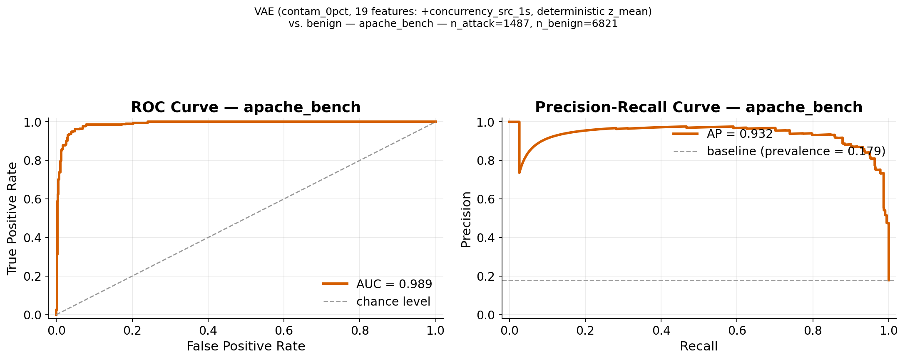

*Şekil 1.1 — VAE, apache_bench için ROC eğrisi (solda) ve Precision-Recall
eğrisi (sağda). ROC-AUC = 0.58, rastgele tahmine (0.5) çok yakın — model
bu saldırı tipini benign'den neredeyse hiç ayırt edemiyor.*

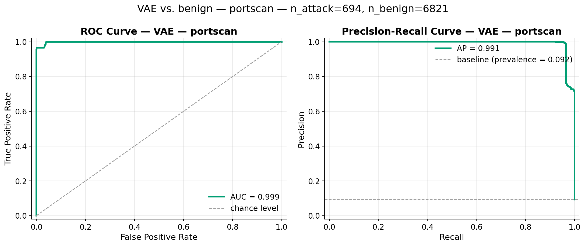

*Şekil 1.2 — VAE, portscan için ROC eğrisi ve PR eğrisi. ROC-AUC = 0.998,
neredeyse mükemmel ayrım.*

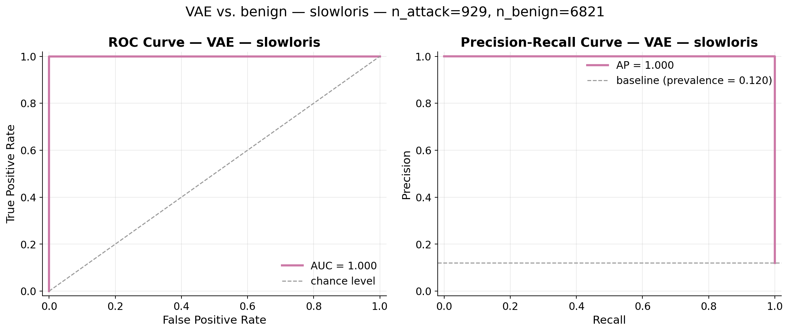

*Şekil 1.3 — VAE, slowloris için ROC eğrisi ve PR eğrisi. ROC-AUC = 1.000,
tam ayrım.*

### 1.4 Dense v1 sonuçları

| attack_type | n_benign | n_attack | ROC-AUC | PR-AUC | F1 (thr95) | Benign FPR (thr95) | Attack Recall (thr95) |
|---|---|---|---|---|---|---|---|
| apache_bench | 6821 | 1487 | 0.6957 ± 0.0791 | 0.2704 ± 0.0406 | 0.0401 ± 0.0003 | 0.0615 ± 0.0023 | **0.0262 ± 0.0000** |
| portscan | 6821 | 694 | 0.9988 ± 0.0007 | 0.9912 ± 0.0032 | 0.7645 ± 0.0135 | 0.0615 ± 0.0023 | 0.9931 ± 0.0155 |
| slowloris | 6821 | 929 | 1.0000 ± 0.0000 | 1.0000 ± 0.0000 | 0.8157 ± 0.0055 | 0.0615 ± 0.0023 | 1.0000 ± 0.0000 |

*(kaynak: `01_single_attack_type/dense_v1/results.csv` / `.md`)*

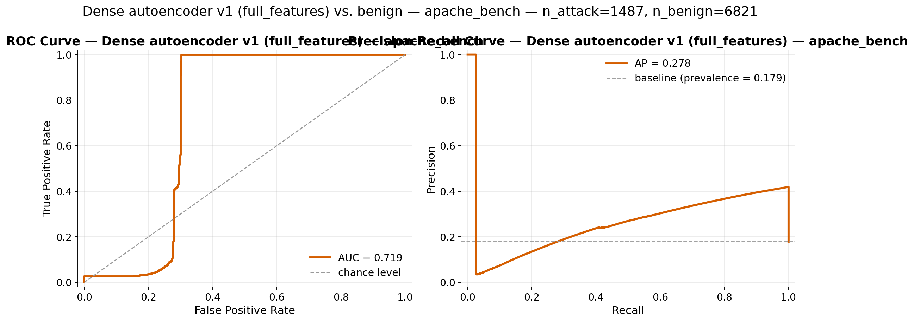

*Şekil 1.4 — Dense v1, apache_bench için ROC ve PR eğrisi. ROC-AUC = 0.696
— VAE'den (0.58) biraz daha iyi ham ayrım gücü, ama recall hâlâ (%2.6)
neredeyse sıfır.*

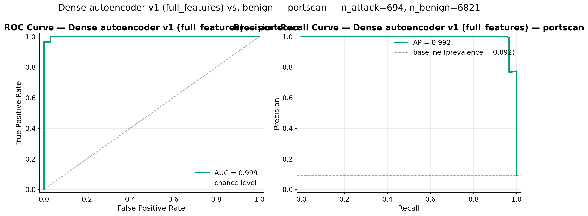

*Şekil 1.5 — Dense v1, portscan için ROC ve PR eğrisi.*

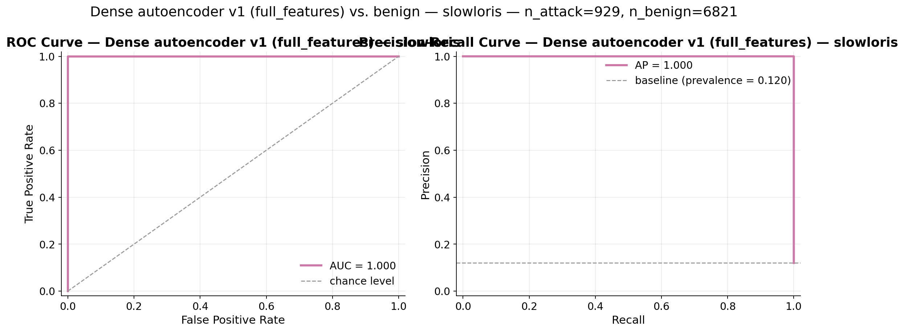

*Şekil 1.6 — Dense v1, slowloris için ROC ve PR eğrisi.*

### 1.5 Neden bu sonuç çıktı? (ön açıklama — detay bölüm 4'te)

portscan ve slowloris neredeyse mükemmel tespit ediliyor (recall ≥ %98.8),
ama **apache_bench her iki modelde de neredeyse hiç tespit edilmiyor**
(VAE recall = %3.3, Dense v1 recall = %2.6, ROC-AUC sırasıyla 0.58 / 0.70
— rastgeleye yakın). Kısaca: apache_bench tek bir flow olarak incelendiğinde
sıradan, tamamlanmış bir HTTP GET isteğine benziyor (`conn_state=SF`, HTTP
servis, kısa süre) — mevcut 18 feature'lık set bunu benign HTTP trafiğinden
ayıramıyor. portscan (yarı-açık taramalar, alışılmadık `conn_state`
değerleri) ve slowloris (30 saniye+ açık tutulan bağlantı, ekstrem
`byte_ratio`) ise benign'in normal aralığının çok dışına düşen feature
değerleri üretiyor. Bu farkın istatistiksel kanıtı bölüm 4'te detaylıca
sunulmaktadır.

---

## 2. İkili Grup Analizi

### 2.1 3 ikili kombinasyonun oluşturulması

`06_attack_type_analysis/evaluate_pairwise_attack_type.py`, 3 olası ikiliyi
(portscan+apache_bench, portscan+slowloris, apache_bench+slowloris) test
ediyor. Her ikili için değerlendirme seti: **tüm benign flow'lar + ikilideki
2 tipin saldırı flow'ları** (3. tip o çalıştırmadan tamamen dışlanıyor —
etiketsiz gürültü olarak karışmıyor). Model/eşik bölüm 1 ile birebir aynı.

### 2.2 VAE sonuçları

| Pair | n_attack | ROC-AUC | PR-AUC | F1 (thr95) | Recall poolü (thr95) |
|---|---|---|---|---|---|
| portscan + apache_bench | 2181 | 0.7135 ± 0.0527 | 0.5598 ± 0.0232 | 0.4447 ± 0.0070 | 0.3369 ± 0.0061 |
| portscan + slowloris | 1623 | 0.9993 ± 0.0002 | 0.9975 ± 0.0007 | 0.8905 ± 0.0105 | 0.9953 ± 0.0057 |
| apache_bench + slowloris | 2416 | 0.7427 ± 0.0474 | 0.6283 ± 0.0219 | 0.5170 ± 0.0054 | 0.4044 ± 0.0029 |

*(kaynak: `02_pairwise_attack_type/vae/results.csv` / `.md`)*

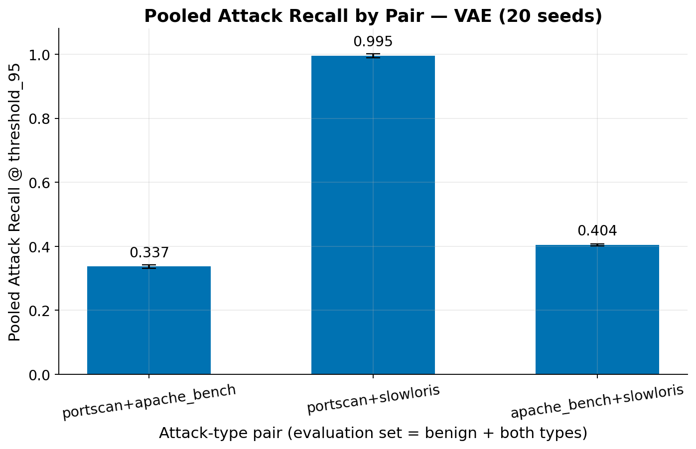

*Şekil 2.1 — VAE, 3 ikili kombinasyon için poolanmış (pooled) recall.
apache_bench içeren ikililerde recall %34-40 gibi görünüyor.*

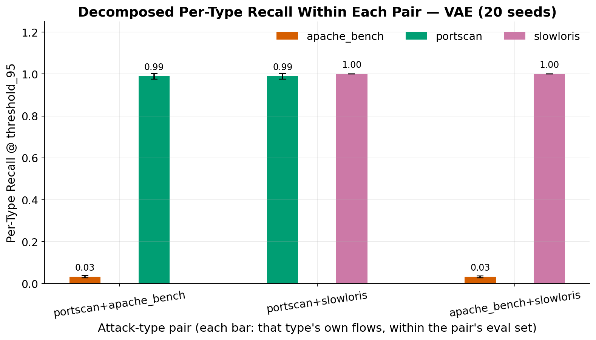

*Şekil 2.2 — Aynı ikililerin recall'ü, çift içindeki her tip için ayrı ayrı
(decomposed) gösteriliyor. apache_bench'in kendi recall'ü ~%3.2'de sabit
kalıyor — poolanmış grafikteki "iyileşme" burada kayboluyor.*

### 2.3 Dense v1 sonuçları

| Pair | n_attack | ROC-AUC | PR-AUC | F1 (thr95) | Recall poolü (thr95) |
|---|---|---|---|---|---|
| portscan + apache_bench | 2181 | 0.7921 ± 0.0539 | 0.6023 ± 0.0370 | 0.4375 ± 0.0069 | 0.3339 ± 0.0049 |
| portscan + slowloris | 1623 | 0.9995 ± 0.0003 | 0.9981 ± 0.0008 | 0.8840 ± 0.0068 | 0.9970 ± 0.0066 |
| apache_bench + slowloris | 2416 | 0.8127 ± 0.0487 | 0.6663 ± 0.0344 | 0.5090 ± 0.0021 | 0.4007 ± 0.0000 |

*(kaynak: `02_pairwise_attack_type/dense_v1/results.csv` / `.md`)*

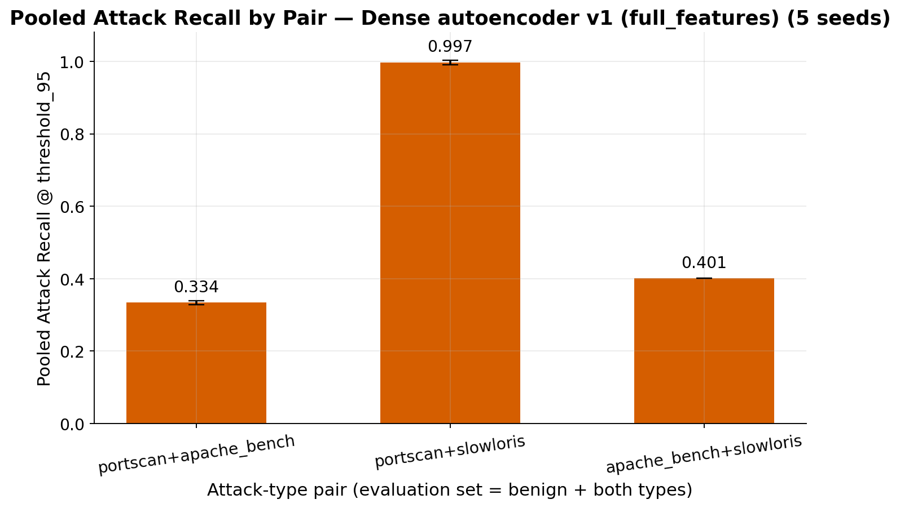

*Şekil 2.3 — Dense v1 için poolanmış recall, VAE ile aynı örüntü.*

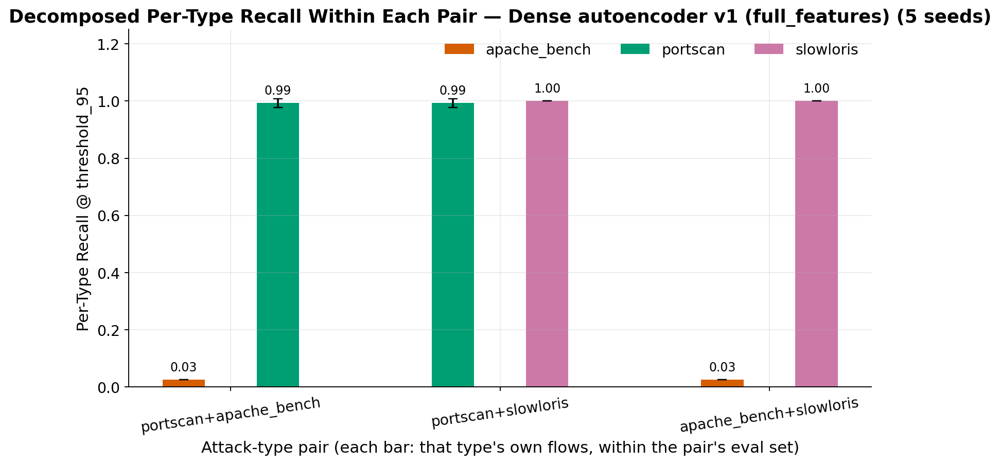

*Şekil 2.4 — Dense v1 için ayrıştırılmış recall; apache_bench yine sabit
düşük kalıyor.*

### 2.4 Pooled vs. decomposed recall farkının anlamı — neden pooled sayı yanıltıcı olabilir

Bu bölümün en kritik noktası şudur: **pooled recall, çiftin TÜM saldırı
flow'larını birlikte sayar; decomposed recall ise çift içindeki her tipin
KENDİ flow'larını ayrı ayrı sayar, aynı model/eşikte.**

Örnekle açıklayalım: `portscan+apache_bench` ikilisinde poolanmış recall
%33.69 çıkıyor. Bu sayıya sadece bakan biri "apache_bench, portscan ile
eşleştirilince daha iyi tespit ediliyor" sonucuna varabilir — çünkü tek
başına apache_bench recall'ü sadece %3.3 idi. **Ama bu bir yanılsamadır.**
Poolanmış recall yükseliyor çünkü bu ikili, iyi tespit edilen 694 portscan
flow'unu da içeriyor (recall ≈ %98.9) — ikisi karışık sayıldığında ortalama
mekanik olarak yukarı çekiliyor. apache_bench'in **kendi** flow'larındaki
tespit oranı bu ikili içinde ayrıca hesaplandığında (decomposed recall):

| Değerlendirme seti | Recall poolü (ikili) | apache_bench'in kendi recall'ü (decomposed) |
|---|---|---|
| apache_bench (tek başına) | — | 0.0328 ± 0.0055 |
| portscan + apache_bench (ikili) | 0.3369 ± 0.0061 | 0.0324 ± 0.0050 |
| apache_bench + slowloris (ikili) | 0.4044 ± 0.0029 | 0.0322 ± 0.0048 |

*(kaynak: `06_attack_type_analysis/results_combined.md`)*

apache_bench'in kendi recall'ü **0.0322-0.0328 aralığında sabit kalıyor** —
tek başına mı yoksa başka bir tiple mi değerlendirildiği, seed gürültüsü
dahilinde hiçbir fark yaratmıyor. Bunun nedeni yapısaldır: her iki
autoencoder da **flow-bazlı, statik bir karar mekanizması** kullanıyor —
bir flow'un "attack" olarak flaglenip flaglenmeyeceği kararı, sadece o
flow'un kendi reconstruction error'ının sabit eşiği geçip geçmediğine
bağlıdır; değerlendirme setinde hangi başka flow'ların bulunduğuna hiç
bakılmaz. Dolayısıyla poolanmış recall'deki yükseliş, apache_bench'in
gerçekte daha iyi tespit edilmesinden değil, sadece payda ve pay içindeki
karışımdan kaynaklanan aritmetik bir etkidir.

### 2.5 Sonuç: apache_bench'in pairing ile değişmediği bulgusu

**Ampirik doğrulama: apache_bench'in kendi recall'ü, tek başına veya başka
bir tiple birlikte değerlendirilse de değişmiyor** (0.0322-0.0328 aralığı,
seed gürültüsü içinde). Poolanmış recall'deki %33-40'lık görünür artış,
gerçek bir apache_bench tespit iyileşmesi değil, popülasyon karışımının bir
artefaktıdır — bu nokta özellikle "pairing apache_bench tespitini
iyileştiriyor" gibi hatalı bir sonuca varılmasını önlemek için açıkça
vurgulanmıştır.

---

## 3. Bloklu (Segmented) Enjeksiyon Deneyi

### 3.1 Bloklu dizinin oluşturulma amacı (sıra-bağımlılık testi)

`07_segmented_injection/build_segmented_injection.py`, `test_with_attack_type.csv`'deki
**aynı flow'ları** (hiç sentetik veri yok, yerine koyarak (with-replacement)
yeniden örnekleme de yok) tek bir akışa yeniden diziyor: benign havuzu 4
neredeyse eşit segmente bölünüyor, ve her benign segment çifti arasına
tek bir bitişik (contiguous) saldırı bloğu ekleniyor, yapılandırılabilir
sırayla (`--order` parametresi ile): `apache_bench → slowloris → portscan`.
Sonuç dizisi: benign → apache_bench → benign → slowloris → benign →
portscan → benign (9931 flow, `segmented_sequence.csv`).

Bu deneyin amacı, modelin **sıra-bağımlılığı** (sequence-dependence) olup
olmadığını test etmektir: gerçek dünyada bir saldırı, karışık trafiğin
içine serpiştirilmiş halde değil, genellikle **bitişik bir patlama**
(burst) halinde gelir. Eğer model sequence-state taşıyorsa (örneğin önceki
flow'ların etkisiyle sonraki flow'un skorunu değiştiren bir mekanizma
varsa), bloklu dizide davranış karışık test setinden farklı çıkabilirdi.

### 3.2 VAE sonuçları

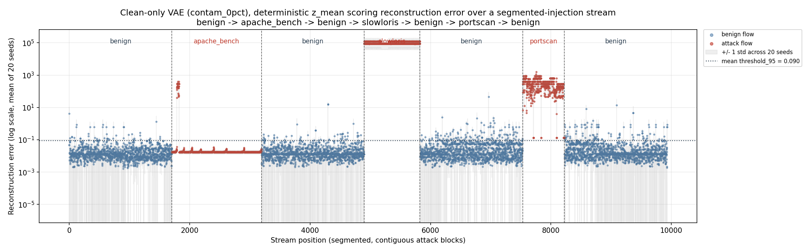

*Şekil 3.1 — VAE clean-only'nin reconstruction error'ı (log ölçek, 20 seed
ortalaması), segmented akıştaki pozisyona göre. Dikey çizgiler segment
sınırlarını, yatay kesikli çizgi ortalama `threshold_95` değerini
gösteriyor. apache_bench bloğu görsel olarak benign seviyesinde kalırken,
slowloris ve portscan blokları eşiğin hemen üzerine sıçrıyor.*

| Segment | n | Benign FPR (thr95) | Attack Recall (thr95) | F1 (thr95) | Karışık test setinde recall (referans) |
|---|---|---|---|---|---|
| benign (seg. 0) | 1705 | 0.0305 ± 0.0070 | — | — | — |
| apache_bench | 1487 | — | 0.0322 ± 0.0044 | 0.0623 ± 0.0083 | 0.0328 ± 0.0055 |
| benign (seg. 2) | 1705 | 0.0336 ± 0.0078 | — | — | — |
| slowloris | 929 | — | 1.0000 ± 0.0000 | 1.0000 ± 0.0000 | 1.0000 ± 0.0000 |
| benign (seg. 4) | 1705 | 0.0962 ± 0.0222 | — | — | — |
| portscan | 694 | — | 0.9882 ± 0.0148 | 0.9940 ± 0.0075 | 0.9889 ± 0.0138 |
| benign (seg. 6) | 1706 | 0.0696 ± 0.0088 | — | — | — |

*(kaynak: `03_segmented_injection/vae/block_recall_f1.md`, ortalama
threshold_95 = 0.1246)*

### 3.3 Dense v1 sonuçları

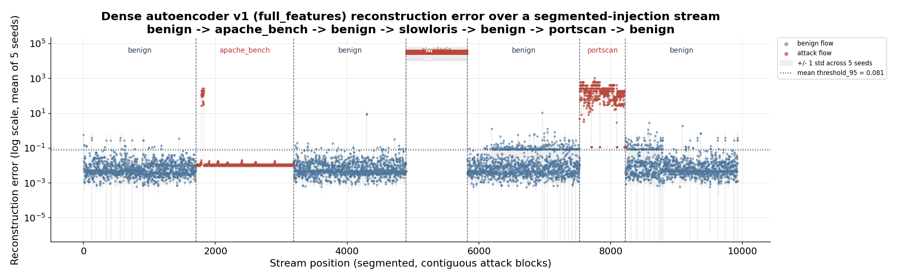

*Şekil 3.2 — Aynı segmented akış, Dense autoencoder v1 ile değerlendirilmiş.
apache_bench bloğu neredeyse tamamen düz ve deterministik bir çizgi
oluşturuyor (5 seed üzerinden recall standart sapması = 0.0000) — VAE'nin
daha gürültülü bulutunun aksine (reparameterization'ın stokastik
örneklemesinden kaynaklanıyor) — ama hata seviyesi benzer şekilde eşiğin
çok altında kalıyor.*

| Segment | n | Benign FPR (thr95) | Attack Recall (thr95) | F1 (thr95) | Karışık test setinde recall (referans) |
|---|---|---|---|---|---|
| benign (seg. 0) | 1705 | 0.0183 ± 0.0046 | — | — | — |
| apache_bench | 1487 | — | 0.0262 ± 0.0000 | 0.0511 ± 0.0000 | 0.0262 ± 0.0000 |
| benign (seg. 2) | 1705 | 0.0171 ± 0.0064 | — | — | — |
| slowloris | 929 | — | 1.0000 ± 0.0000 | 1.0000 ± 0.0000 | 1.0000 ± 0.0000 |
| benign (seg. 4) | 1705 | 0.1336 ± 0.0175 | — | — | — |
| portscan | 694 | — | 0.9931 ± 0.0155 | 0.9965 ± 0.0079 | 0.9931 ± 0.0155 |
| benign (seg. 6) | 1706 | 0.0771 ± 0.0028 | — | — | — |

*(kaynak: `03_segmented_injection/dense_v1/block_recall_f1.md`)*

### 3.4 Blok geçişlerinde davranış değişimi var mı?

**Hayır.** Blok bazlı recall değerleri (VAE: 0.0322 / 1.0000 / 0.9882;
Dense v1: 0.0262 / 1.0000 / 0.9931), karışık test setindeki referans
değerlerle (VAE: 0.0328 / 1.0000 / 0.9889; Dense v1: aynı, çünkü Dense v1'in
zaten karışık-set recall'ü tam bu değerlerdi) **neredeyse birebir aynı** —
fark, seed gürültüsünün mertebesinde. Saldırının karışık mı yoksa bitişik
blok halinde mi geldiği, modelin bir flow'a verdiği kararı değiştirmiyor.

### 3.5 VAE'nin statik/hafızasız doğası ve sonucu neden etkilemediği

Bu sonuç, aslında beklenen ve doğrulanması gereken bir hipotezdi: hem VAE
hem de Dense autoencoder, **her flow'u birbirinden bağımsız olarak
skorlayan, sequence-state taşımayan** modellerdir. Bir flow'un
reconstruction error'ı, sadece o flow'un kendi 18 feature değerine ve
sabit model ağırlıklarına bağlıdır — önceki veya sonraki flow'ların
sırası, kimliği veya sayısı bu hesaplamaya hiçbir şekilde girmez. Bu
nedenle "bitişik blok" ile "karışık sıra" arasında herhangi bir davranış
farkı **beklenmiyordu**; bu bölümün amacı bu varsayımı varsaymak değil,
ampirik olarak doğrulamaktı — ki doğrulanmıştır.

### 3.6 Benign FPR dalgalanması üzerine temkinli not

Benign-segment FPR'ı, VAE için **%3.05 ile %9.62 arasında**, Dense v1 için
**%1.71 ile %13.36 arasında** dalgalanıyor (tüm benign havuzu tek blok
olarak ölçüldüğünde sırasıyla ortalama %5.75 ve %6.15 ile karşılaştırılınca).
Bu dalgalanmaya bakıp modelin akış boyunca "drift" ettiği (davranışının
kaydığı) sonucuna varmak cazip olabilir — **ama bu muhtemelen sadece bir
örneklem artefaktıdır.** Her segment sadece ~1700 flow içeriyor; beklenen
%5-6 FPR için bu mütevazı bir örneklem büyüklüğüdür ve bu boyuttaki güven
aralığı gözlemlenen farkı rahatlıkla kapsıyor. Modelin flow'lar arasında
taşıdığı hiçbir state olmadığından, burada akla yatkın hiçbir drift
mekanizması yoktur — bu dalgalanma, daha büyük n (daha geniş segmentler,
daha fazla seed) ile yeniden çalıştırılıp doğrulanmadan/çürütülmeden
yorumlanmamalıdır.

---

## 4. Apache_Bench Neden Bu Kadar Zor? (Kök Neden Analizi)

Bu bölüm, apache_bench'in neden bu kadar zayıf tespit edildiğini araştıran
en detaylı diagnostik bölümdür. Anlatım kronolojiktir: önce ham istatistiğe
bakılıp yanlış bir ilk izlenim oluşuyor, sonra etki büyüklüğü (effect size)
incelenince bu izlenim düzeltiliyor, son olarak zamansal (temporal) bir
hipotez test ediliyor.

**Protokol.** Bölüm 1-3'teki tüm sonuçların *neden* ortaya çıktığını
anlamak için, feature-bazında bir diagnostik yürütüldü: 18 scaled feature
sütununun her biri için apache_bench ile benign arasında Kolmogorov-Smirnov
(KS) testi + ortalama kayması (benign standart sapması cinsinden), ardından
ardışık aynı-etiketli flow'lar arasındaki **flow'lar-arası varış süresi**
(inter-arrival time, IAT) üzerine bir zamansal hipotez testi. Hiçbir veri
değiştirilmedi, hiçbir yeniden eğitim yapılmadı — bu raporun geri kalanı
gibi, clean-only VAE (`contam_0pct`) üzerinde tamamen inference-only
(kaynak: `10_final_report/04_apache_bench_diagnostics/`).

### 4.1 İlk hipotez ve sayılara bakınca nasıl düzeltildi — KS/mean-shift paradoksu

**İlk bakışta (sadece KS istatistiğine bakılırsa) apache_bench istatistiksel
olarak iyi ayrışıyor gibi görünüyor:** en ayırt edici 5 feature'ın KS
istatistiği 0.62-0.76 aralığında — bu, "bu feature'lar apache_bench'i
benign'den net şekilde ayırıyor" gibi okunabilir bir sayı. **Ama bu ilk
izlenim yanlıştır** ve sadece KS istatistiğine bakılarak varılmıştır. Aynı
tabloya "ortalama kayması" (mean shift, benign standart sapması cinsinden)
sütunu eklenince tamamen farklı bir tablo ortaya çıkıyor:

| Feature | Grup | KS istatistiği | Ortalama kayma (σ benign) |
|---|---|---|---|
| orig_pkts_scaled | paket sayısı/hızı | 0.755 | -0.44 σ |
| orig_bytes_scaled | byte hacmi | 0.755 | -0.39 σ |
| resp_bytes_scaled | byte hacmi | 0.754 | -0.68 σ |
| resp_pkts_scaled | paket sayısı/hızı | 0.754 | -0.62 σ |
| duration_scaled | süre | 0.693 | -0.42 σ |
| byte_ratio_scaled | byte hacmi | 0.679 | -0.37 σ |
| bytes_per_sec_scaled | byte hacmi | 0.672 | -0.24 σ |
| pkts_per_sec_scaled | paket sayısı/hızı | 0.622 | +1.15 σ |

*(kaynak: `04_apache_bench_diagnostics/feature_diagnostics_apache_bench.csv`)*

**Paradoksun çözümü:** KS istatistiği yüksek çıkıyor çünkü apache_bench
**çok dar, düşük varyanslı bir küme** oluşturuyor (`ab` aracı neredeyse
özdeş boyutta bir HTTP GET isteğini defalarca tekrarlıyor — feature
CSV'sindeki p5-p95 percentile sütunlarına bakıldığında `orig_pkts_scaled`
gibi feature'larda bu aralık neredeyse tek bir noktaya çöküyor). Bu dar
küme, benign'in çok daha geniş dağılımına karşı empirik CDF'de **keskin bir
sıçrama** yaratıyor — KS istatistiği tam olarak bunu ölçüyor. Ama kümenin
**merkezi**, benign ortalamasından ortalama sadece 0.4-0.7 standart sapma
uzakta — yani **benign'in normal aralığının içinde**, kuyruğunda değil.
Reconstruction error, benign üzerine öğrenilmiş bir manifold'a göre
feature-bazlı karesel sapmaların toplamı olduğundan, eğitim dağılımının
normal aralığı içinde oturan bir nokta — CDF'sinin benign'inkinden ne kadar
keskin ayrıldığından bağımsız olarak — düzgün (temiz) şekilde
reconstruct edilir.

Karşılaştırma için: portscan ve slowloris'i benign'den güçlü şekilde ayıran
feature'lar (`conn_state_SF`, `byte_ratio_scaled`) ortalamalarını
**31 ila 1300+ benign standart sapması** kadar kaydırıyor — apache_bench
ile kıyaslanamayacak kadar büyük bir mertebe farkı.

### 4.2 feature_diagnostics_*.csv sonuçları — en ve en az ayırt edici feature'lar

Tüm 18 modelleme feature'ı, KS istatistiğine göre sıralanmış tam liste
(one-hot'lar dahil):

| Feature | Grup | KS istatistiği | KS p-değeri | Ortalama kayma (σ benign) |
|---|---|---|---|---|
| orig_pkts_scaled | paket sayısı/hızı | 0.755 | 1.34e-321 | -0.44 σ |
| orig_bytes_scaled | byte hacmi | 0.755 | 1.34e-321 | -0.39 σ |
| resp_bytes_scaled | byte hacmi | 0.754 | 1.35e-321 | -0.68 σ |
| resp_pkts_scaled | paket sayısı/hızı | 0.754 | 1.35e-321 | -0.62 σ |
| duration_scaled | süre | 0.693 | 1.90e-321 | -0.42 σ |
| byte_ratio_scaled | byte hacmi | 0.679 | 2.02e-321 | -0.37 σ |
| bytes_per_sec_scaled | byte hacmi | 0.672 | 2.08e-321 | -0.24 σ |
| pkts_per_sec_scaled | paket sayısı/hızı | 0.622 | 3.28e-321 | +1.15 σ |
| service_http | servis (one-hot) | 0.225 | 8.42e-55 | +0.52 σ |
| service_none | servis (one-hot) | 0.168 | 1.41e-30 | -0.42 σ |
| proto_udp | protokol (one-hot) | 0.051 | 3.72e-03 | -0.23 σ |
| service_dns | servis (one-hot) | 0.051 | 3.72e-03 | -0.23 σ |
| proto_tcp | protokol (one-hot) | 0.051 | 3.72e-03 | +0.23 σ |
| conn_state_REJ | bağlantı durumu (one-hot) | 0.026 | 3.63e-01 | n/a (benign'de sabit) |
| conn_state_SF | bağlantı durumu (one-hot) | 0.025 | 4.12e-01 | -0.79 σ |
| service_ssh | servis (one-hot) | 0.007 | 1.00 | -0.08 σ |
| conn_state_RSTO | bağlantı durumu (one-hot) | 0.001 | 1.00 | -0.03 σ |
| conn_state_S1 | bağlantı durumu (one-hot) | 0.000 | 1.00 | n/a (benign'de sabit) |

**En ayırt edici feature'lar:** `orig_pkts_scaled`, `orig_bytes_scaled`,
`resp_bytes_scaled`, `resp_pkts_scaled` (KS ≥ 0.75) — ama yukarıda
açıklandığı gibi, bunların hepsi de etki büyüklüğü açısından zayıf (< 0.7σ).
**En az ayırt edici feature'lar:** `conn_state_S1`, `conn_state_RSTO`,
`service_ssh`, `conn_state_SF` (KS ≤ 0.026, p ≥ 0.36) — bunlar apache_bench
ile benign arasında istatistiksel olarak anlamlı bir fark bile göstermiyor.
İlginç bir şekilde `conn_state_SF` (bağlantının tam/başarılı kapandığını
gösteren durum), portscan ve slowloris'i benign'den en güçlü ayıran
feature'lardan biriyken (aşağıya bkz.), apache_bench için neredeyse hiç
ayırt edici değil — çünkü apache_bench zaten normal, tamamlanmış bir HTTP
bağlantısı kuruyor.

**Referans karşılaştırma — portscan ve slowloris:** Aynı diagnostik, bu 2
tip için de çalıştırıldığında, en güçlü feature'ların hem KS hem de etki
büyüklüğü açısından apache_bench'ten kat kat üstün olduğu görülüyor:

| Feature | KS (bu tip) | Ortalama kayma (bu tip, σ benign) | apache_bench KS (aynı feature) | apache_bench kayma (σ benign) |
|---|---|---|---|---|
| conn_state_SF (portscan) | 0.999 | -31.2 σ | 0.025 | -0.79 σ |
| conn_state_REJ (portscan) | 0.965 | n/a | 0.026 | n/a |
| pkts_per_sec_scaled (portscan) | 0.963 | +57.7 σ | 0.622 | +1.15 σ |
| byte_ratio_scaled (slowloris) | 1.000 | +1355.4 σ | 0.679 | -0.37 σ |
| conn_state_SF (slowloris) | 0.999 | -31.2 σ | 0.025 | -0.79 σ |
| conn_state_RSTO (slowloris) | 0.999 | +31.2 σ | 0.001 | -0.03 σ |

portscan yarı-açık taramalar ve reddedilen bağlantılar nedeniyle benign'de
neredeyse hiç tetiklenmeyen `conn_state`/protokol one-hot'larını tetikliyor;
slowloris ise kasıtlı olarak yavaş, uzun süre açık tutulan bağlantılar
nedeniyle normal bir flow'dan çok daha az byte/birim-zaman gönderiyor.
apache_bench ise sıradan, tamamlanmış-el sıkışmalı HTTP trafiği —
flow'ları tek tek bakıldığında sıra dışı değil; sıra dışı olan yalnızca
onların **hacmi ve tekrarı**, ve mevcut feature seti bunu flow-bazında
temsil edecek bir yola sahip değil.

### 4.3 Box plot'lar — en ayırt edici feature'ların görsel karşılaştırması

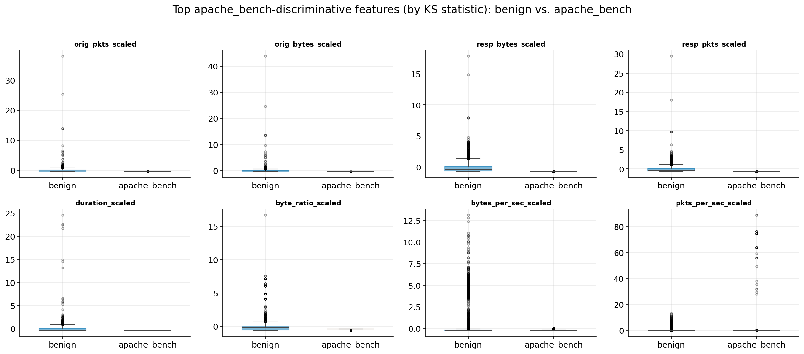

*Şekil 4.1 — KS istatistiğine göre apache_bench-vs-benign ayrımında en
güçlü 8 feature'ın (`orig_pkts_scaled`, `orig_bytes_scaled`,
`resp_bytes_scaled`, `resp_pkts_scaled`, `duration_scaled`,
`byte_ratio_scaled`, `bytes_per_sec_scaled`, `pkts_per_sec_scaled`)
box plot'ları. Yüksek KS istatistiğine rağmen, kutular arasında ağır bir
örtüşme var — mevcut 18-feature'lık sette apache_bench'i izole edecek tek
bir feature veya küçük bir kombinasyon yok.*

Feature grubu bazında ortalama KS istatistiği: byte-hacmi feature'ları
(`orig_bytes_scaled`, `resp_bytes_scaled`, `byte_ratio_scaled`,
`bytes_per_sec_scaled`) = 0.715, paket sayısı/hız feature'ları
(`orig_pkts_scaled`, `resp_pkts_scaled`, `pkts_per_sec_scaled`) = 0.711,
süre (`duration_scaled`) = 0.693, protokol/servis/conn-state one-hot'ları
(10 sütun ortalaması) = sadece 0.060.

### 4.4 Reconstruction error histogramı — üç grup arasındaki sayısal fark

*Şekil 4.2 — VAE reconstruction error dağılımı (log ölçek, 20 seed
ortalaması), benign / apache_bench / portscan+slowloris (birleşik) için.
apache_bench, benign dağılımıyla neredeyse tamamen örtüşüyor.*

| Grup | n | Ortalama error | Std error | Ortalama threshold_95'te flaglenme oranı |
|---|---|---|---|---|
| benign | 6821 | **0.0605** | 0.659 | %4.6 |
| apache_bench | 1487 | **5.746** | 37.9 | %2.6 |
| portscan+slowloris | 1623 | **56906** | 50282 | %100.0 |

*(kaynak: `04_apache_bench_diagnostics/vae_reconstruction_error_summary.csv`)*

Üç grup arasındaki fark çarpıcı: benign ortalama ~0.06, apache_bench ~5.7
(benign'in ~95 katı ama mutlak olarak hâlâ küçük), portscan+slowloris ise
~57000 (benign'in ~940.000 katı). apache_bench'in ortalama error'ı
benign'inkinden büyük olsa da, **eşiği geçen apache_bench flow oranı
(%2.6) benign'in kendi false-positive oranından (%4.6) bile düşük** —
yani apache_bench, threshold_95 eşiğine göre benign'den istatistiksel
olarak *daha az* sıra dışı görünüyor. Bu, bölüm 4.1'deki bulgunun
(apache_bench'in benign'in normal aralığı içinde kaldığı) doğrudan sayısal
kanıtıdır.

### 4.5 Temporal/IAT hipotez testi

Bölüm 4.1-4.4'ün ortak sonucu şu hipotezi doğuruyor: apache_bench'in tekil
flow'ları sıradan olduğu için, onu asıl anormal kılan şey **tekrarının
sıklığı** olabilir. Bu hipotezi test etmek için, mevcut `ts` sütunundan
doğrudan hesaplanan, **modele hiç eklenmemiş** bir aday feature üzerinde
hızlı ve yeniden-eğitimsiz (no-retrain) bir istatistiksel kontrol yapıldı:
aynı `window_id` içinde, aynı etikete sahip ardışık flow'lar arasındaki
**inter-arrival time (IAT)**.

| Grup | n | Ortalama IAT (s) | Std IAT (s) | p5 | p25 | Medyan | p75 | p95 | p99 |
|---|---|---|---|---|---|---|---|---|---|
| benign | 6812 | 10.43 | 90.06 | 0.000173 | 0.00473 | **2.18** | 8.04 | 33.92 | 81.54 |
| apache_bench | 1481 | 24.31 | 291.5 | 0.000667 | 0.000839 | **0.000922** | 0.00168 | 0.00674 | 999.6 |

KS istatistiği = **0.7097**, p-değeri ≈ 0 (n_benign=6812, n_apache_bench=1481).

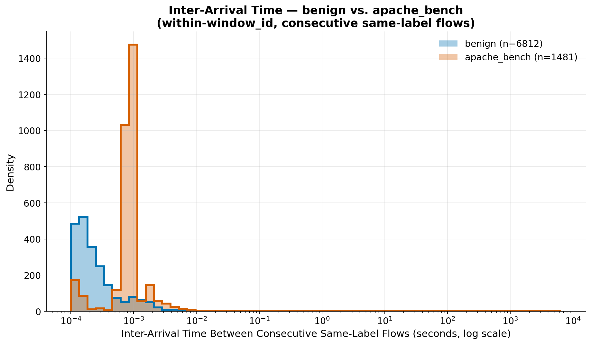

*Şekil 4.3 — IAT dağılımı (log ölçek). apache_bench'in medyanı
(0.00092s), benign'in medyanından (2.18s) yaklaşık **2364 kat** daha kısa.*

**apache_bench'in medyan IAT'ı (0.000922s), benign'in medyanından
(2.18s) yaklaşık 2364 kat daha kısa.** apache_bench'in ortalaması (24.31s)
ve p99'u (999.6s) medyandan çok daha büyük çünkü IAT dağılımı bimodal:
bir apache_bench "burst"ü içindeki istekler 2ms'nin altında art arda
geliyor, ama aynı pencere içindeki ayrı burst'ler arasında çok daha uzun
aralar da oluşabiliyor — bir benchmark aracının, sürekli tek bir akış
yerine hızlı istek patlamaları ateşlemesiyle tutarlı.

### 4.6 Bu bulgunun ne anlama geldiği

**Bu bulgu KS istatistiği açısından "daha iyi" bir feature olduğu anlamına
gelmiyor** — IAT'ın KS'i (0.710), bölüm 4.1'deki en güçlü tekil-flow
feature'larla (0.62-0.76) aynı aralıkta, onları geçmiyor. Farklı olan
**etki büyüklüğü**: bölüm 4.1'deki tekil-flow feature'ları apache_bench'i
benign ortalamasından sadece ~0.4-0.7 standart sapma kaydırırken (yani
benign'in normal aralığının içinde), IAT iki grubun medyanını **~3
mertebe (order of magnitude)** ayırıyor — mevcut 18 feature'ın hiçbirinin
temsil edemediği, tamamen farklı türde bir sinyal.

**Özetle:** tek-flow feature'ları apache_bench'i ayırt edemiyor (etki
büyüklüğü çok küçük), ama flow'lar-arası zamanlama (IAT) çok daha net bir
şekilde ayırıyor (3 mertebe fark) — sorun, apache_bench'in "görünmez" olması
değil; sorun, **mevcut feature setinin bunu bir flow tek başına
değerlendirildiğinde yakalayamamasıdır.** Reconstruction-error tabanlı,
tek-flow skorlayan bir mimari, doğası gereği bu tür flow'lar-arası (bir
IP/hedef/servis'e olan istek sıklığı gibi) bir sinyali göremez.

### 4.7 Retrain ile doğrulanmadığı notu

**Açık uyarı: bu test yalnızca istatistiksel ayrışabilirlik kontrolüdür —
bir yeniden eğitimle (retrain) DOĞRULANMAMIŞTIR.** Hiçbir yeniden eğitim
yapılmadı; bu feature'ı (veya bir varyantını — istek hızı, eşzamanlılık)
VAE'ye ekleyip yeniden eğitmenin, apache_bench'in reconstruction error'ını
gerçekten eşiğin üzerine çıkaracağının hiçbir garantisi yok. Bunun
doğrulanması, kapsamı bu diagnostikten açıkça dışarıda bırakılmış tam bir
yeniden-eğitim + yeniden-değerlendirme döngüsü gerektirir.

---

## 5. VAE vs Dense v1 Genel Karşılaştırma

**Protokol.** Bölüm 1-3'teki 3 analiz, aynı flow'lar, aynı 18 feature
sütunu, aynı `threshold_95` konvansiyonuyla, `phase3_dense/04_phase3_models/full_features`
(5 seed) üzerinde birebir tekrarlandı. Dense v1'in seed başına kaydedilmiş
bir `threshold.json`'ı olmadığından, eşik `phase3_dense/03_phase3_splits`
validation benign flow'larının reconstruction error'ının 95. percentile'ı
olarak uçuşta yeniden hesaplandı. Dense v1, VAE ile aynı `_scaled`
sütunlarını, ayrı bir scaler olmadan tüketiyor (doğrulandı: kendi
split'lerinin `row_index`'leri, resampled pencerelere ofsetsiz şekilde
tamamen `features_all_windows.csv`'ye işaret ediyor).

### 5.1 Tekil tip performansı karşılaştırması

| attack_type | Model | ROC-AUC | PR-AUC | F1 (thr95) | Attack Recall (thr95) |
|---|---|---|---|---|---|
| apache_bench | VAE | 0.5815 ± 0.0768 | 0.2133 ± 0.0219 | 0.0507 ± 0.0081 | **0.0328 ± 0.0055** |
| apache_bench | Dense v1 | 0.6957 ± 0.0791 | 0.2704 ± 0.0406 | 0.0401 ± 0.0003 | **0.0262 ± 0.0000** |
| portscan | VAE | 0.9982 ± 0.0005 | 0.9886 ± 0.0023 | 0.7737 ± 0.0161 | 0.9889 ± 0.0138 |
| portscan | Dense v1 | 0.9988 ± 0.0007 | 0.9912 ± 0.0032 | 0.7645 ± 0.0135 | 0.9931 ± 0.0155 |
| slowloris | VAE | 1.0000 ± 0.0000 | 1.0000 ± 0.0000 | 0.8271 ± 0.0158 | 1.0000 ± 0.0000 |
| slowloris | Dense v1 | 1.0000 ± 0.0000 | 1.0000 ± 0.0000 | 0.8157 ± 0.0055 | 1.0000 ± 0.0000 |

*(kaynak: `08_dense_v1_comparison/results_single_attack_type_dense.csv/.md`)*

### 5.2 Macro-average tablo

| Model | Recall macro (3 tip) | F1 macro (3 tip) |
|---|---|---|
| VAE | **0.6739** | **0.5505** |
| Dense v1 | **0.6731** | **0.5401** |

İki model arasındaki fark (≤ 0.01), **VAE'nin apache_bench üzerindeki
kendi seed-içi varyansından bile küçük** (std ROC-AUC = 0.077) — dolayısıyla
iki modelden hiçbiri, saldırı tipleri arasında diğerinden anlamlı ölçüde
daha "dengeli" değil. Motif her iki modelde de aynı: portscan ve slowloris
neredeyse mükemmel, apache_bench neredeyse tamamen kaçırılıyor.

### 5.3 apache_bench zayıflığının her iki mimaride de var olmasının anlamı

**Dense autoencoder v1, apache_bench'i VAE'den en az o kadar kötü
kaçırıyor** (recall %2.6 vs %3.3, F1 0.040 vs 0.051) — bölüm 1-3'teki 3
protokolün (tekil, ikili, segmented) hepsinde iki model neredeyse özdeş
şekilde başarısız oluyor. İlginç bir nüans: Dense v1'in apache_bench
üzerinde **ham ayrım gücü biraz daha iyi** (ROC-AUC 0.696 vs 0.581, PR-AUC
0.270 vs 0.213) — yani sürekli skoru apache_bench flow'larını benign'e
göre biraz daha iyi sıralıyor — ama bu avantaj gerçek `threshold_95`
eşiğinde daha iyi tespite **dönüşmüyor**, çünkü her model kendi benign
error dağılımına göre bağımsız olarak kalibre ediliyor.

**Bu bir model/mimari sorunu değil, feature set kaynaklı yapısal bir
kısıttır.** İki farklı mimari (değişken sayısı, katman yapısı, kayıp
fonksiyonu, olasılıksal/deterministik latent uzay farklı) neredeyse özdeş
şekilde başarısız oluyorsa, sorunun kaynağı mimarilerin ortak paydası
olan **girdi feature setinde** aranmalıdır — mimari değiştirmek muhtemelen
bu sorunu tek başına çözmeyecektir (bölüm 4'teki IAT bulgusunun işaret
ettiği gibi, gereken şey flow'lar-arası bir sinyal).

---

## 6. Genel Model Skorları ile Bu Bulgunun İlişkisi

Bu rapordaki bulgular, projenin daha önce raporlanmış **toplu (agregat)**
model skorlarıyla ilk bakışta çelişiyor gibi görünebilir:

- Dense autoencoder v1 (`full_features`), agregat ikili `is_attack`
  metriğinde **test AUC = 0.9463 ± 0.0104**
  (`phase3_dense/05_phase3_results/full_features_summary.json`).
- VAE (beta=0.25, çoklu-seed denetimleri), agregat ikili metrikte
  **test AUC ≈ 0.92** (0.9259 ± 0.0095, n=5, `phase3_vae/08_beta_multiseed/README.md`;
  bağımsız olarak 0.9197 ± 0.0149, n=10, `phase3_vae/07_seed_variance/README.md`
  ile tutarlı).
- Kontaminasyon sweep'inin clean-only (`contam_0pct`) varyantı, agregat
  **PR-AUC = 0.7156 ± 0.0086** (`phase3_vae/05_contamination_sweep/05_results/results_summary.csv`).

**Bu sayılar neden bu kadar yüksek görünüyor, apache_bench neredeyse hiç
tespit edilemezken?** Cevap, bu skorların hesaplanma şeklinde yatıyor: hepsi
**agregat, ikili `is_attack` metrikleridir** — yani test setindeki TÜM
saldırı flow'ları (portscan + apache_bench + slowloris, tipe göre ayrım
yapılmadan) tek bir "attack" sınıfı olarak havuzlanıp benign'e karşı
değerlendiriliyor. Test setindeki saldırı popülasyonunun dağılımına
bakıldığında: 1487 apache_bench, 694 portscan, 929 slowloris — yani
apache_bench saldırı flow'larının **%47.8'ini** oluşturuyor, ama diğer
%52.2 (portscan + slowloris) **neredeyse mükemmel** tespit ediliyor
(recall ≥ %98.8, ROC-AUC ≥ 0.998).

Agregat bir AUC veya PR-AUC hesaplanırken, model skorlarının **tüm**
saldırı flow'larını benign'den ne kadar iyi sıraladığına bakılıyor.
portscan ve slowloris flow'ları, reconstruction error'ları benign'den
mertebelerce (bölüm 4.4'te görüldüğü gibi ~57000 vs ~0.06) yüksek olduğu
için, bu flow'lar sıralamanın en üstünde net bir şekilde ayrışıyor ve
agregat AUC/PR-AUC hesaplamasını güçlü şekilde yukarı çekiyor —
apache_bench'in kendi flow'larının reconstruction error dağılımı benign'e
neredeyse tamamen karışsa bile. Başka bir deyişle: **test popülasyonunda
ağırlıklı olarak "kolay" (portscan/slowloris gibi çok sapan) örnekler
olduğu için, toplu skor apache_bench'in zayıflığını istatistiksel olarak
maskeliyor** — agregat metrik, kötü performansı iyi performansla
ortalayarak "gizliyor", tek tek saldırı tipine göre kırılım yapılmadığı
sürece bu maskeleme fark edilmiyor.

Bu, tam olarak bölüm 1'de anlatılan attack_type kırılımının **neden gerekli
olduğunun** kanıtıdır: agregat metrikler, bu projede olduğu gibi saldırı
tiplerinin tespit zorluğu çok farklıysa, en zayıf halkayı sistematik olarak
gizleyebilir.

---

## 7. Sonuç ve Öneriler

### 7.1 Ana çıkarımların özeti

1. **İkili `is_attack` metriği, apache_bench üzerinde ciddi bir yapısal
   zayıflığı maskeliyor** (modele göre recall %2.6-3.3), bu zayıflık
   mevcut agregat raporlarda görünmüyor çünkü diğer 2 tip (neredeyse
   mükemmel tespit edilen, recall ≥ %98.8) tarafından sulandırılıyor.
2. **Bu recall, değerlendirme setine başka bir saldırı tipinin eşlik
   etmesiyle iyileşmiyor** (decomposed recall, tek başına veya ikili
   içinde ~%3.2-3.3'te sabit) — poolanmış recall'deki görünür artış,
   popülasyon karışımının bir artefaktıdır, gerçek bir iyileşme değil.
3. **Flow'ların geliş sırası (karışık vs bitişik blok) modelin davranışını
   değiştirmiyor** — VAE ve Dense v1'de ampirik olarak doğrulandı, ikisinin
   de sequence-state taşımayan, flow-bazlı statik dedektörler olmasıyla
   tutarlı.
4. **apache_bench zayıflığı hem VAE hem de Dense autoencoder v1'de ortak**
   — iki farklı mimari neredeyse özdeş şekilde başarısız oluyor, bu da
   sorunun belirli bir modelin kusurundan çok **mevcut 18 feature'lık
   setin bir sınırlaması** olduğuna işaret ediyor. Otoencoder mimarisini
   değiştirmek muhtemelen bu sorunu tek başına çözmeyecektir.
5. **Kök neden analizi** (bölüm 4), apache_bench'in tekil flow'larının
   benign'in normal aralığı içinde kaldığını (ortalama kayması < 1.2σ),
   ama flow'lar-arası varış süresinin (IAT) benign'den ~2364 kat daha
   kısa olduğunu gösteriyor — mevcut feature setinin yakalayamadığı bir
   sinyal.

### 7.2 İleri adım önerisi: flow-pencere bazlı feature mühendisliği

Bölüm 4 ve 6'daki bulgular, açık ve kanıta dayalı bir sonraki adıma işaret
ediyor: **flow-pencere bazlı (flow-window) feature mühendisliği** — yani
tek bir flow'un kendi özelliklerinin ötesine geçip, o flow'un belirli bir
zaman penceresi içindeki diğer flow'larla ilişkisini yakalayan feature'lar
eklemek. Somut adaylar:

- **Inter-arrival time (IAT)** — aynı kaynak/hedef/servise ait ardışık
  flow'lar arasındaki süre (bölüm 4.5'te ~2364x fark, KS=0.71 ile
  gösterildi).
- **Eşzamanlılık (concurrency)** — belirli bir kısa pencerede aynı
  hedefe açılan eşzamanlı bağlantı sayısı.
- **Tekrar oranı (request rate)** — birim zamanda aynı (kaynak, hedef,
  hedef-port) üçlüsüne giden istek sayısı.

**Bu önerinin gerekçesi kanıta dayalıdır, varsayıma değil:** bölüm 4.1-4.4,
apache_bench'in tekil-flow feature'larının (byte/paket/süre) neden yetersiz
kaldığını (etki büyüklüğü < 1σ, benign'in normal aralığı içinde) sayısal
olarak gösterdi; bölüm 4.5-4.6 ise aynı verinin (`ts` sütunu) üzerinden
hesaplanan bir flow'lar-arası feature'ın (IAT), aynı iki grup arasında
~3 mertebelik bir etki büyüklüğü farkı yarattığını gösterdi — mevcut
feature setinin sahip olmadığı bir sinyal türü. **Ancak bu, bölüm 4.7'de
vurgulandığı gibi, henüz bir retrain ile doğrulanmamış bir hipotezdir** —
sıradaki adım, bu tür bir feature'ı (veya birkaçını) ekleyip modeli
yeniden eğitip yeniden değerlendirerek, apache_bench'in reconstruction
error'ının gerçekten eşiğin üzerine çıkıp çıkmadığını doğrulamaktır.

### 7.3 Sınırlama notu — threshold_95'in küçük val setinden kalibrasyonu (denetim bulgusu O4)

Her seed'in `threshold_95`'i, yalnızca **653 flow'luk** bir val-benign
seti (window_10 validation split'i) üzerindeki reconstruction error'ın
95. persentilidir — yani sıralamada ~33. en büyük değere dayanan bir sıra
istatistiği. Bunun iki ölçülmüş sonucu var
(`10_final_report/06_scripts/o4_threshold_transfer/`, 20 seed,
deterministik z_mean skor, retrain yok):

**(1) Threshold doğası gereği gürültülü.** Seed'ler arasında threshold_95
0.043 ile 0.153 arasında değişiyor (ortalama 0.090, **CV %27.9**); tek
seed içinde bile persentil tahmininin bootstrap %95 güven aralığının
ortalama genişliği threshold'un ~%60'ı. Yani seed'ler arası görünen
threshold oynaklığının önemli bir kısmı model farkı değil, n=653'ten
ağır sağ-kuyruklu bir dağılımın kuyruk persentilini tahmin etmenin doğal
gürültüsüdür.

**(2) Val→test transferi kabaca tutuyor, ama sistematik bir sapmayla.**
Val'den kalibre edilen threshold, test setinin benign flow'larında
(kalibrasyon window'undan farklı window'lar) nominal %5.00 yerine
ortalama **%5.77 ± 0.58** FPR gerçekleştiriyor (20 seed'in 18'inde >%5 —
yönlü bir sapma, gürültü değil); test-benign'de tam %5 verecek threshold
ortalama %8 daha yüksek olurdu. İki benign error dağılımı arasındaki KS
istatistiği ortalama 0.067 — saptanabilir ama küçük bir kayma. Bu veri
setinde transfer makul çalışıyor; ancak **farklı bir deployment
ortamında sapmanın bu kadar küçük kalacağının garantisi yoktur** —
orada threshold yerel benign trafikten yeniden kalibre edilmelidir.

Kapsam: threshold'dan bağımsız metrikler (ROC-AUC, PR-AUC) bu bulgudan
etkilenmez; etkilenen yalnızca threshold_95'e bağlı çalışma noktası
metrikleridir (recall, F1, benign FPR).

### 7.4 Sınırlama notu — VAE ve Dense v1 aynı eğitim verisiyle eğitilmedi (denetim bulgusu O5)

Bölüm 5'teki karşılaştırma, **aynı test flow'ları, aynı 18 kolon ve aynı
threshold konvansiyonuyla** yapılıyor — değerlendirme tarafı elma-elma.
Ancak **eğitim tarafında** iki model mimariden çok daha fazlasıyla
ayrışıyor: VAE yalnızca window_10'un benign'iyle eğitildi (**3.049**
train flow'u, 20 seed, rastgele 70/15/15 split), Dense v1 ise window_01-08
ile (**23.274** train flow'u — ~7,6 kat fazla, 5 seed, signature bazlı
GroupShuffleSplit). Ayrıca window_10'da Dense'in one-hot encoder'ının
(yalnızca Dense'in train'inde fit edilmiştir) hiç görmediği kategorik
değerler var (`proto=icmp`, `conn_state ∈ {OTH, S0}`) — bu flow'lar
VAE'nin eğitim verisinde all-zero kodlanmıştır, kategorik sinyalleri
kayıptır. Scaler'ın kendisi bir confound değildir (tek sefer, Dense'in
train'inde fit edilip iki tarafa da uygulanır — ortak ölçek); confound
eğitim verisinin kompozisyonu, hacmi ve kategori kapsamıdır.

Sonuç olarak bölüm 5'teki ince taneli karşılaştırmalar — macro
neredeyse-eşitlik (0.674/0.551 vs 0.673/0.540) ve "Dense'in apache_bench
üzerinde ham ayrım gücü biraz daha iyi" nüansı (ROC-AUC 0.696 vs 0.581) —
tek başına mimariye atfedilemez: eğitim verisi farkı bu sayılara
ayrıştırılamaz biçimde karışır. "3 analiz aynı şekilde tekrarlandı"
tarzı ifadeler değerlendirme protokolünü anlatır, eğitim koşullarını
değil — bu notla birlikte okunmalıdır.

Ana bulgu ise bu confound'dan **zayıflamaz, güçlenir**: iki farklı
mimari, çok farklı eğitim verileriyle (window kompozisyonu, ~7,6 kat
hacim, kategori kapsamı) apache_bench üzerinde aynı deseni veriyor
(recall ≤ %3,3). Ortak payda ne model ne eğitim seti — 18 kolonluk
feature uzayı; bu da bölüm 7.1'deki "feature-set sınırlaması" çıkarımını
daha da destekler. (Analiz: `10_final_report/06_scripts/o5_train_data_confound/`.)

### 7.5 Tehdit modeli notu — ground truth davranışa değil kaynak IP'ye dayanır (denetim bulgusu O7)

Proje genelinde `is_attack` etiketi flow'un **davranışıyla değil, kaynak
makinenin kimliğiyle** tanımlıdır: lab-only filtresinin (kaynak **ve**
hedef, 3 IP'lik lab kümesinde) ardından
`is_attack = (id.orig_h == 192.168.10.2)`. Etikete hiçbir davranışsal
veya imza bazlı sinyal girmez; orkestrasyon logları (`attack_log.csv`)
yalnızca saldırı **tipini** sonradan atamak için kullanılır — attack
etiketli flow'ların %100'ünün 1 sn toleransla bir saldırı komut
aralığına düşmesi, etiketin *bu lab kurulumunda* pratikte temiz
olduğunu gösterir. IP bir model girdisi değildir (18 feature kolonunda
IP yoktur): sınırlama feature'larda değil, "neyin saldırı sayıldığı"
tanımındadır.

Bunun sonucu: modellerin ayırmayı öğrendiği şey, katı anlamda
"saldırgan makineden çıkan trafiğin istatistiksel imzası"dır —
semantik bir "kötücül davranış" kavramı değil. Bu eşdeğerliğin bozulduğu
senaryolar değerlendirmenin kapsamı dışındadır: saldırganın IP
değiştirmesi veya IP sahteciliği (spoofing), aynı kaynağın arkasında
meşru + kötücül karışık trafik (NAT, ele geçirilmiş ama normal trafik
de üreten bir makine), "güvenilir" bir makineden yanal hareket. Bu
durumlara genelleme test edilmemiştir ve garanti edilemez.

Bu not projenin diğer bulgularını geçersiz kılmaz — contamination
sweep, attack-type analizleri ve apache_bench tanıları **bu ground
truth tanımı altında** geçerlidir. Ancak "gerçek dünya deployment"
okumalarının kapsamını sınırlar: saldırganın tek ve adanmış bir kaynak
olmadığı bir ortamda, buradaki sayıları taşımadan önce etiket ↔
davranış eşleşmesinin (imza/davranış bazlı etiketlemeyle) yeniden
kurulması gerekir. (Kapsam doğrulaması:
`10_final_report/06_scripts/o7_ip_based_ground_truth/`.)

---

## 8. Dosya/Klasör Haritası

`10_final_report/` altındaki her klasörün içeriği:

- **`01_single_attack_type/`** — Her attack type için benign'e karşı ayrı
  değerlendirme (ROC-AUC, PR-AUC, F1, recall). `vae/` ve `dense_v1/` alt
  klasörlerinin her birinde 3 PNG (`roc_pr_<tip>.png`) + `results.csv`/`.md`.
- **`02_pairwise_attack_type/`** — 3 ikili kombinasyon (portscan+apache_bench,
  portscan+slowloris, apache_bench+slowloris) için pooled/decomposed recall
  grafikleri ve tabloları, `vae/` ve `dense_v1/` altında.
- **`03_segmented_injection/`** — Bloklu (contiguous) enjeksiyon deneyinin
  pozisyona göre error-plot grafikleri ve blok bazlı recall/F1 tabloları,
  `vae/` ve `dense_v1/` altında.
- **`04_apache_bench_diagnostics/`** — apache_bench'in neden kaçırıldığını
  araştıran kök neden analizi: `findings.md`, feature bazlı KS/etki
  büyüklüğü CSV'leri, reconstruction error histogramı, box plot'lar, IAT
  histogramı ve özet CSV'leri.
- **`05_notebooks/`** — Yukarıdaki 4 script ailesinin mantığını hücre
  hücre, ara çıktı/grafiklerle yeniden üreten, tamamı çalıştırılmış
  Jupyter notebook'ları (`01_attack_type_analysis.ipynb`,
  `02_segmented_injection.ipynb`, `03_dense_v1_comparison.ipynb`,
  `04_apache_bench_diagnostics.ipynb`).
- **`06_scripts/`** — Bu raporun tüm sonuçlarını üreten script'lerin
  referans kopyaları (orijinal konumlarını yansıtan alt klasörlerle):
  `06_attack_type_analysis/`, `07_segmented_injection/`,
  `08_dense_v1_comparison/`, `apache_bench_diagnostics/`,
  `dependencies/` (paylaşılan yardımcı fonksiyonlar), `report_generation/`
  (bu final raporun grafiklerini üreten script'ler).
- **`07_final_written_report/`** — Yazılı final rapor (Fransızca),
  `rapport_final_attack_type_analysis.{md,pdf}` — Gérard için hazırlanmış
  teknik rapor, apache_bench diagnostiğini de içeriyor.
- **`08_documentation/`** — Bu doküman (`DOCUMENTATION.md` / `.pdf`) —
  tüm sürecin Türkçe, adım adım, hiçbir teknik detayı atlamayan tam
  anlatımı.
- **`README.md`** (üst dizinde) — Klasör yapısının genel indeksi ve kısa
  özeti.

---

*Bu doküman, `10_final_report/` altındaki tüm CSV, MD ve PNG kaynak
dosyalarından türetilmiştir; hiçbir sayı veya grafik elle uydurulmamış,
hepsi kaynak dosyalarından doğrudan alınmıştır. Kaynak dosya yolları her
bölümde açıkça belirtilmiştir.*
