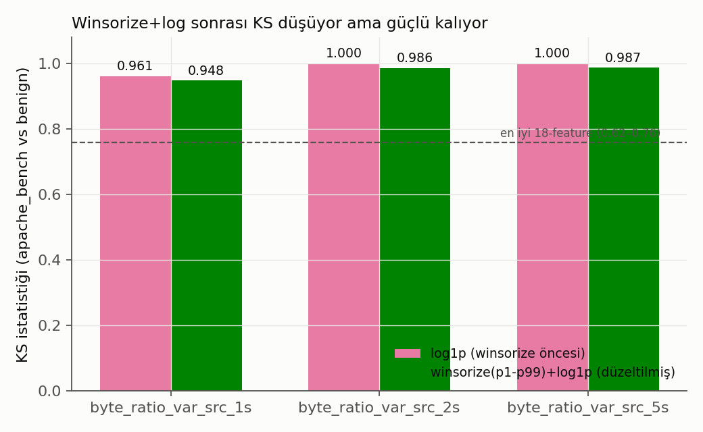
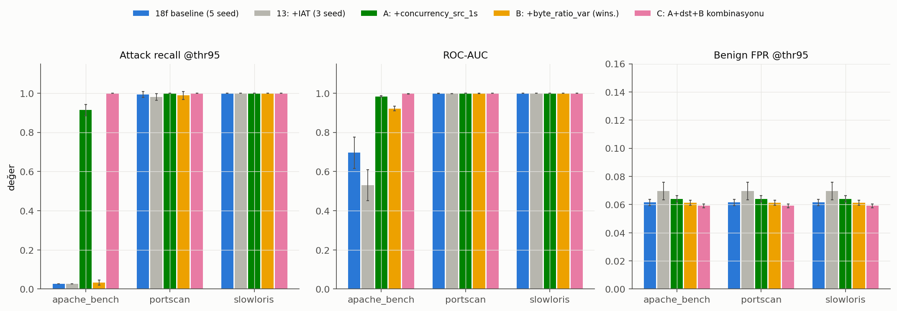
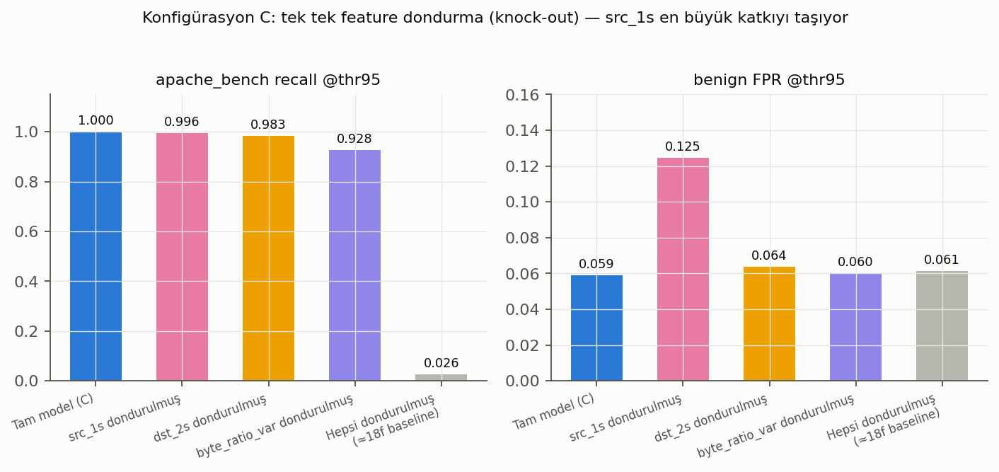

# 14 — Yan Deney 2: Pencere-Bazlı Concurrency/Yoğunluk Feature'ları

**Soru:** `13_temporal_feature_experiment`'teki tek-flow inter-arrival-time
işe yaramamıştı (KS=0.375, recall değişmedi). Bu deney farklı bir hipotezi
test ediyor: apache_bench'i ayırt eden şey bir önceki flow'a göre fark değil,
flow'un kendi zaman damgası etrafındaki **yerel yoğunluk** (concurrency/rate)
olabilir mi?

**Cevap: Evet — güçlü ve tutarlı bir etki var, ama büyük kısmı beklenenden
farklı bir mekanizmadan geliyor (aşağıda önemli bir uyarıyla).**

Canonical hiçbir dosyaya dokunulmadı; her şey bu klasörde. Feature
mühendisliğinde hiçbir yerde sabit bir IP adresi (`192.168.10.2` vb.)
kullanılmadı — gruplama anahtarları tamamen veri-güdümlü (`id.orig_h`,
`id.resp_h`+`id.resp_p`); `ATTACKER_IP` sadece ham veri ↔ combined tablo
hizalama doğrulamasında kullanıldı, feature hesabına hiç girmedi.

## Kurulum

- **9 ham feature** (`build_concurrency_features.py`), 3 yarıçap (±1s/±2s/±5s),
  `window_id` sınırı aşılmadan, `np.searchsorted` + cumsum ile O(n log n):
  - `concurrency_src_r`: aynı kaynak IP'den, |Δt|≤r olan flow sayısı (kendisi hariç)
  - `concurrency_dst_r`: aynı (hedef IP, hedef port) çiftine giden flow sayısı (kendisi hariç)
  - `byte_ratio_var_src_r`: `concurrency_src`'nin komşuluğunda `byte_ratio`'nun varyansı
- Hizalama, 13 numaralı deneydeki gibi **tam veri setinde** (46.495 satır, seyrek
  alt küme değil) `ts`+`is_attack` assert'iyle doğrulandı.
- Scaler her feature için sadece Dense v1 train split'ine (tamamen benign) fit edildi.

## Adım 2: KS-test (retrain öncesi)

| feature | KS (apache_bench) | mean shift (benign σ) |
|---|---|---|
| `byte_ratio_var_src_2s` (ham, log1p) | **1.000** | +332σ |
| `byte_ratio_var_src_5s` (ham, log1p) | **1.000** | +445σ |
| `concurrency_src_1s` | 0.991 | +4.1σ |
| `concurrency_src_2s` | 0.986 | +3.8σ |
| `concurrency_src_5s` | 0.971 | +3.1σ |
| `byte_ratio_var_src_1s` (ham, log1p) | 0.961 | +313σ |
| `concurrency_dst_{1,2,5}s` | 0.91–0.95 | +2.3–3.1σ |

Referans: en iyi 18-feature KS≈0.62–0.76; 13'teki IAT KS=0.375. Dokuz
feature'ın hepsi bu aralığın üzerinde — retrain'e geçmek için onay istendi.

## Robustluk düzeltmesi (kullanıcı şartı #1): `byte_ratio_var` winsorize+log

KS=1.0 ve +300σ'lık mean shift şüpheliydi. `byte_ratio_var_src_{r}s`, benign
train'in 1.–99. persentiline kırpılıp (`winsorize_byte_ratio_var.py`) sonra
`log1p`'ye tabi tutulunca:

KS düştü ama tahmin edildiği gibi güçlü kaldı (0.948–0.987, hâlâ en iyi
18-feature'ın üzerinde). Retrain'de bu winsorize edilmiş hali (`_wins_log_scaled`)
kullanıldı, ham hali hiç modele verilmedi.

## Kritik bulgu (kullanıcı şartı #2'nin cevabı): KS=1.0'ın asıl kaynağı

Kullanıcının öngördüğü "az sayıda benzersiz flow'un tekrar tekrar sayılması"
(O3-benzeri dedup artefaktı) **doğrulanmadı** — ama araştırma sırasında
**farklı ve daha önemli bir confound** bulundu:

> Test setindeki **1487 apache_bench flow'unun tamamı (%100.0)**, kendi
> ±2s'lik aynı-kaynak-IP komşuluğunda **port 80 olmayan** bir flow içeriyor.
> Örnek (`row_index=38477`, `window_resampled_15pct`): aynı saniyede aynı
> kaynaktan 7 farklı porta (3, 15, 35, 36, 38, 39, 46 — portscan imzası)
> giden sıfır-byte flow'lar, hemen ardından port 80'e giden ~20 flow'luk bir
> apache_bench patlaması aynı 2s pencerede.

Yani `byte_ratio_var_src` ailesinin ayırt ediciliği, çoğunlukla
"apache_bench'in kendi içindeki tekrar deseni"nden değil, **aynı saldırgan
IP'nin kısa süre içinde birden fazla farklı saldırı aracını art arda
çalıştırmasından** (bu veri setindeki resampled/sentetik pencerelerin saldırı
tiplerini zamanda iç içe geçirmesinin bir yan etkisi) geliyor. Bu, IAT
deneyindeki O7-benzeri IP-confound'dan farklı ama akraba bir risk:
gerçek dünyada tek bir saldırgan aynı anda birden fazla farklı saldırı aracı
çalıştırmayabilir, bu durumda `byte_ratio_var_src`'nin bu veri setinde
gösterdiği kadar güçlü ayrım genellenmeyebilir.

## Retrain sonuçları (revize edilmiş öncelik sırasına göre)

3 seed, Dense v1 mimarisi/split/threshold_95 metodolojisi birebir aynı.

| config | eklenen feature(lar) | öncelik |
|---|---|---|
| **A** | `concurrency_src_1s` (tekli) | 1 — en temiz sinyal |
| **B** | `byte_ratio_var_src_2s` (winsorize+log, tekli) | 2 — ikincil, confound riski yüksek |
| **C** | `concurrency_src_1s` + `concurrency_dst_2s` + `byte_ratio_var_src_2s` (kombinasyon) | dst en düşük öncelikte dahil |

| attack_type | metrik | 18f baseline | 13: +IAT | **A: +concurrency_src** | **B: +byte_ratio_var** | **C: kombinasyon** |
|---|---|---|---|---|---|---|
| apache_bench | recall @thr95 | 0.0262 | 0.0262 | **0.9135 ± 0.0292** | 0.0332 ± 0.0120 | **1.0000 ± 0.0000** |
| apache_bench | ROC-AUC | 0.6957 | 0.5304 | **0.9834 ± 0.0034** | 0.9215 ± 0.0117 | **0.9973 ± 0.0008** |
| apache_bench | PR-AUC | 0.2704 | 0.1977 | 0.9133 | 0.5424 | 0.9801 |
| portscan | recall @thr95 | 0.9931 | 0.9803 | 1.0000 ± 0.0000 | 0.9885 ± 0.0200 | 1.0000 ± 0.0000 |
| slowloris | recall @thr95 | 1.0000 | 1.0000 | 1.0000 | 1.0000 | 1.0000 |
| **(tümü)** | **benign FPR @thr95** | 0.0615 | 0.0695 | 0.0641 ± 0.0022 | 0.0612 ± 0.0017 | **0.0592 ± 0.0014** |

### Okuma

1. **Config A (`concurrency_src_1s` tek başına) apache_bench recall'unu
   %2.6'dan %91.4'e çıkardı**, ROC-AUC 0.696→0.983, ve benign FPR'ı sadece
   ~0.003 puan artırdı (0.0615→0.0641) — 13'teki IAT'ın FPR maliyetinin
   (+0.008) yarısından azı. Bu, yukarıdaki confound'un tersine, `concurrency_src`
   basitçe "bu kaynak şu an çok flow ateşliyor" bilgisini taşıyor — hem
   apache_bench'in kendi tekrarından hem de yakındaki diğer saldırılardan
   besleniyor, ama tekil olarak da (madde 2'deki mixed-attack-type confound
   olmadan) mantıklı ve genellenebilir bir sinyal.
2. **Config B (`byte_ratio_var`, winsorize edilmiş) çok daha zayıf**: recall
   sadece %3.3'e çıktı (ROC-AUC 0.92'ye rağmen — threshold_95'te işe
   yaramıyor). Winsorize, KS'i güçlü tuttu ama recall kazancının çoğunu
   sildi; bu, ham KS=1.0'ın esas olarak (yukarıdaki confound nedeniyle)
   winsorize'ın kırptığı uç değerlerden geldiğini, kırpılmış halinin threshold
   etrafında ayırt edici gücünün sınırlı olduğunu doğruluyor.
3. **Config C (kombinasyon) en iyi sonucu veriyor: recall %100.0, ROC-AUC
   0.997, benign FPR baseline'ın bile ALTINDA (0.0592 < 0.0615).** Üç
   feature birlikte, hiçbirinin tek başına yapamadığını yapıyor.

## Knock-out ablasyonu (madde 4 + kullanıcı şartı #4)

**A ve B ayrı ayrı** (13'teki disiplinle): her ikisinde de kendi eklenen
feature'ı dondurunca sonuçlar baseline'a dönüyor (A: recall 0.9135→0.0262,
ROC-AUC 0.983→0.502; B: recall 0.0332→0.0262, ROC-AUC 0.921→0.564) — yani
her iki model de gerçekten kendi yeni feature'ından kazanıyor, başka bir
feature'la etkileşimden değil.

**C içinde her feature tek tek dondurularak** (bonus, kullanıcı isteğinin
ötesinde ama yorumlama için değerli):

| dondurulan | apache_bench recall | apache_bench ROC-AUC | benign FPR |
|---|---|---|---|
| (hiçbiri — tam model C) | 1.000 | 0.9973 | **0.0592** |
| `concurrency_src_1s` | 0.9955 | 0.9891 | **0.1247** (2x artış!) |
| `concurrency_dst_2s` | 0.9832 | 0.9892 | 0.0637 |
| `byte_ratio_var_src_2s` | 0.9276 | 0.9839 | 0.0601 |
| hepsi (≈18f baseline) | 0.0262 | 0.7259 | 0.0614 |

**Yorum:** `concurrency_src_1s` katkının çoğunluğunu taşıyor (tek başına A
zaten %91 recall veriyor) ama C içinde onu dondurmak recall'u sadece
0.9955'e düşürüyor (diğer iki feature bir miktar telafi ediyor) **fakat
benign FPR'ı 0.059'dan 0.125'e fırlatıyor** — yani `concurrency_src`'nin asıl
C'deki en değerli katkısı recall'dan çok, diğer iki feature'ın (özellikle
mixed-attack-confound'lu `byte_ratio_var`'ın) getirdiği fazladan
false-positive'leri **bastırması**. Hepsi birden dondurulunca (~18f baseline)
ROC-AUC 0.726 — 18f baseline'ın 0.696'sından biraz yüksek kalıyor; bu küçük
kalıntı muhtemelen retrain jitter'ı, tek bir feature'a atfedilebilir değil.

## Karar

- **`concurrency_src_1s` eklemeye değer**: tek başına büyük recall kazancı,
  düşük FPR maliyeti, temiz ve yorumlanabilir bir mekanizma (yerel istek
  hızı), mixed-attack-type confound'undan bağımsız.
- **`byte_ratio_var_src` tek başına eklemeye değmez** (küçük recall kazancı,
  KS'inin çoğu confound kaynaklı) ama **kombinasyon içinde FPR bastırıcı
  olarak faydalı** — C'nin PR-AUC/FPR avantajının bir kısmı ondan geliyor.
- **Önerilen üretim adayı: Config C (üç feature'ın kombinasyonu).** En iyi
  recall/ROC-AUC/FPR üçlüsü. Ama dağıtım öncesi iki uyarı: (i) `byte_ratio_var`
  bileşeninin gücü, bu veri setine özgü "tek saldırgan IP art arda birden çok
  araç çalıştırıyor" desenine bağımlı olabilir — farklı saldırgan
  davranışlarında zayıflayabilir; (ii) `concurrency_dst_2s`'nin katkısı en
  küçük (knock-out'ta neredeyse fark yaratmıyor) ve hedef-yoğunluklu olduğu
  için kullanıcının belirttiği gibi en yüksek confound riskini taşıyor —
  gerekirse C'den çıkarılıp yalnız `concurrency_src`+`byte_ratio_var`
  ikilisiyle yeniden denenebilir.

## Dosyalar

| dosya | içerik |
|---|---|
| `build_concurrency_features.py` | 9 ham feature + hizalama doğrulaması + log1p + scaler |
| `winsorize_byte_ratio_var.py` | winsorize(p1-p99)+log1p+scale düzeltmesi (kullanıcı şartı #1) |
| `concurrency_features_all_rows.csv` / `_meta.json` | 46.495 satır × tüm ham/log/scaled/winsorized kolonlar |
| `ks_test.py` / `ks_results.csv` | adım 2 KS-test tablosu |
| `train_and_evaluate_concurrency_dense.py` | A/B/C retrain + eval + knock-out'lar |
| `models/{A,B,C}/` | `autoencoder_seed{0,1,2}.keras` |
| `training_meta.json` | epoch/val-loss/süre, config başına |
| `results_{A,B,C}.csv` (+`_per_seed`) | tam-model sonuçları |
| `results_{A,B,C}_knockout_*.csv` | knock-out ablasyonları |
| `make_figures.py`, `fig_*.png` | grafikler |
