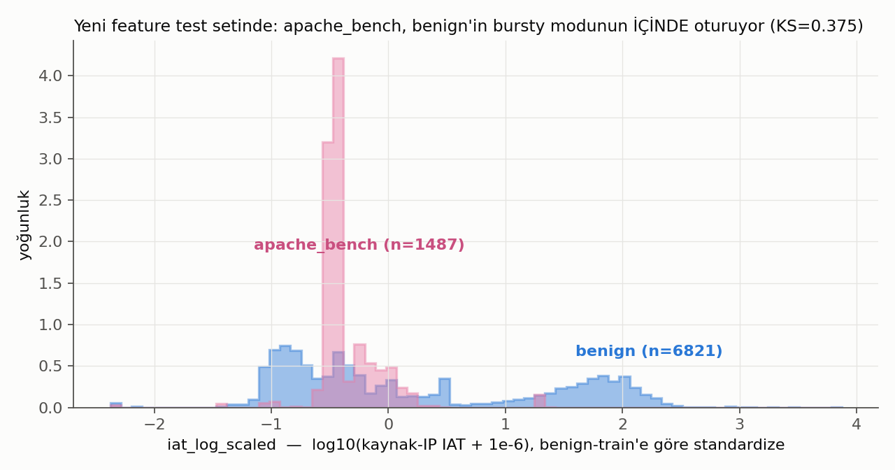
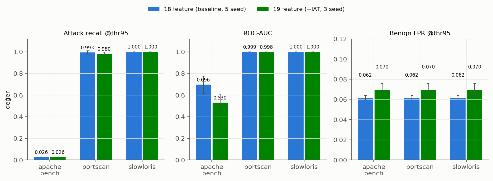

# 13 — Yan Deney: Flow'lar-arası Inter-Arrival Time (IAT) Feature'ı

**Soru:** `findings.md` (04_apache_bench_diagnostics) bölüm 5-6'daki hipotez —
apache_bench'in tek tek flow'ları sıradan, anormal olan *tekrar hızı*; modele
flow'lar-arası bir zamanlama feature'ı verilirse apache_bench recall'u artar mı?

**Cevap: Hayır.** 19-feature (+IAT) Dense v1, apache_bench recall'unu hiç
değiştirmedi (%2.62 → %2.62, birebir aynı flow'lar), ROC-AUC'u düşürdü
(0.696 → 0.530) ve benign FPR'ı artırdı (%6.15 → %6.95). Üstelik deney,
findings.md bölüm 6'daki "2364x IAT farkı"nın bir ölçüm artefaktı olduğunu
ortaya çıkardı (aşağıda §Ön bulgu).

Canonical hiçbir dosyaya dokunulmadı; her şey bu klasörde.

## Kurulum

- **Feature (`build_iat_feature.py`):** her flow için, **aynı kaynak IP'nin**
  aynı `window_id` içindeki bir önceki flow'una göre geçen süre. Kaynak-hedef
  çiftine göre değil, sadece kaynak IP'ye göre (genel bir ağ feature'ı).
  İlk flow'lar (46.495 satırda 19 adet) benign-train medyan IAT'ıyla (1.27 ms)
  dolduruldu, NaN yok. Transform: `log10(IAT + 1e-6)`. Scaler (standardize)
  **sadece Dense v1 train split'i** üzerinde fit edildi (split tamamen benign —
  mevcut leakage-free kural korunuyor).
- **Hizalama doğrulaması:** feature tablolarında IP kolonu olmadığından
  `id.orig_h`, ham Zeek conn.log'ları faz2 ile birebir aynı filtre+sıralamayla
  yeniden okunarak bağlandı; 46.495 satırın tamamında `ts` + `is_attack`
  eşleşmesi assert'le doğrulandı.
- **Retrain (`train_and_evaluate_iat_dense.py`):** Dense v1 mimarisi ve tüm
  hiperparametreler birebir aynı (16→8→16, dropout 0.15, L2 1e-4, adam/mse,
  epochs≤200, batch 128, EarlyStopping patience=12), aynı
  `phase3_dense/03_phase3_splits` split'leri, threshold_95 = per-seed
  val-benign hata p95'i. Tek değişken: 18 → 19 feature. 3 seed (0,1,2).
- **Değerlendirme:** `06_attack_type_analysis/evaluate_by_attack_type.py`'ın
  `assemble_labeled_features_df` / `evaluate_group` fonksiyonları aynen import
  edilerek, baseline tabloyla aynı test seti ve metodolojiyle.

## Ön bulgu: findings.md'deki 2364x farkı bir artefakttı

findings.md bölüm 6, IAT'ı yalnızca **test alt kümesi** üzerinde diff'lemişti;
flow'ların ~%85'i arada atlandığı için benign medyan IAT 2.18 s çıkmıştı. Tüm
flow'lar üzerinde (bir modele gerçekten verilebilecek, doğru tanım) benign
medyan IAT **1.98 ms** — apache_bench'in 0.92 ms'inden sadece ~2x uzakta,
çünkü benign trafik üreticisi de bursty. Scaled log-IAT'ta KS istatistiği
**0.375** — mevcut en iyi tek-flow feature'larından (0.62-0.76) *zayıf* bir
ayırıcı. Histogram bunu net gösteriyor: apache_bench'in dar IAT tepesi,
benign'in kendi bursty modunun içine oturuyor.

## Sonuçlar

Baseline: `08_dense_v1_comparison/results_single_attack_type_dense.md`
(18 feature, 5 seed). Yeni: bu klasör (19 feature, 3 seed). Aynı test seti
(6.821 benign + tip başına saldırılar), mean ± std.

| attack_type | metrik | 18 feature (baseline) | 19 feature (+IAT) | +IAT, knock-out* |
|---|---|---|---|---|
| apache_bench | recall @thr95 | 0.0262 ± 0.0000 | **0.0262 ± 0.0000** | 0.0262 ± 0.0000 |
| apache_bench | ROC-AUC | 0.6957 ± 0.0791 | **0.5304 ± 0.0786** | 0.5489 ± 0.1383 |
| apache_bench | PR-AUC | 0.2704 ± 0.0406 | 0.1977 | 0.2126 |
| portscan | recall @thr95 | 0.9931 ± 0.0155 | 0.9803 ± 0.0171 | 0.9654 ± 0.0000 |
| portscan | ROC-AUC | 0.9988 ± 0.0007 | 0.9978 ± 0.0007 | 0.9974 ± 0.0002 |
| slowloris | recall @thr95 | 1.0000 ± 0.0000 | 1.0000 ± 0.0000 | 1.0000 ± 0.0000 |
| slowloris | ROC-AUC | 1.0000 ± 0.0000 | 1.0000 ± 0.0000 | 1.0000 ± 0.0000 |
| (tümü) | **benign FPR @thr95** | 0.0615 ± 0.0023 | **0.0695 ± 0.0062** | 0.0627 ± 0.0021 |

\* Knock-out: aynı eğitilmiş 19-feature modeller, inference'ta IAT kolonu
benign-train ortalamasına (≈0) sabitlenerek.

### Okuma

1. **apache_bench recall hiç değişmedi.** Üç seed'de de tam olarak baseline'ın
   yakaladığı %2.62'lik aynı sabit alt küme yakalanıyor. IAT feature'ı
   threshold_95'i aşan tek bir yeni apache_bench flow'u üretmedi.
2. **Benign FPR arttı (0.0615 → 0.0695).** Deney öncesi öngörülen risk
   gerçekleşti: yeni feature, meşru yüksek-frekans benign trafiği de bir miktar
   "saldırı" tarafına itti. Knock-out FPR'ı baseline seviyesine (0.0627)
   döndürüyor, yani fazladan false-positive'lerin kaynağı doğrudan IAT
   kolonunun reconstruction hatası.
3. **ROC-AUC düşüşü (0.696 → 0.530).** apache_bench'in scaled IAT'ı benign
   medyanından *negatif* yönde saptığı ama benign'in bursty modunun içinde
   kaldığı için, IAT hata katkısı benign'in yayvan kuyruğunda apache_bench'ten
   daha çok hata üretiyor — sıralama (AUC) apache_bench aleyhine bozuluyor.
   (Baseline'ın seed-varyansı ±0.079 olduğundan düşüşün bir kısmı retrain
   jitter'ı olabilir; knock-out'un 0.549'u da bunu destekliyor.)

## IP-confound kontrolü (madde 4)

- **Knock-out testi:** IAT kolonu sabitlenince metrikler pratikte baseline'a
  dönüyor (yukarıdaki tablo, son kolon). Yani model iyileşmeyi bu feature'dan
  almıyor — çünkü ortada bir iyileşme yok; feature'ın tek ölçülebilir etkisi
  FPR'daki artış. Diğer feature'larla anlamlı bir etkileşim de görünmüyor
  (knock-out ile 19-feature sonuçları arasındaki fark küçük ve recall'da sıfır).
- **Yapısal confound notu:** bu lab veri setinde **tek benign kaynak IP ve tek
  saldırgan IP** var. "Kaynak IP başına IAT" tanımı biçimsel olarak IP-agnostik
  olsa da, pratikte benign IAT'ları yalnız benign flow'lar arasından, saldırı
  IAT'ları yalnız saldırı flow'ları arasından hesaplanıyor — feature kısmen
  etiket bilgisini kodlayabilirdi. Sonuç negatif çıktığı için bu confound bir
  iyileşmeyi şişirme riski doğurmadı; ama gelecekte pozitif bir sonuç
  alınırsa, önce çok-IP'li bir kurulumda doğrulanmalı.

## Karar

Kaynak-IP IAT feature'ı bu haliyle **eklemeye değmez**: recall kazancı sıfır,
FPR maliyeti pozitif. findings.md bölüm 5'in daha geniş hipotezi (pencere
bazlı rate/concurrency feature'ları — örn. aynı hedef servise saniyedeki
bağlantı sayısı, son N flow'un IAT varyansı) bu deneyle **çürütülmüş değil**;
burada test edilen yalnızca en basit tek-flow-gecikmesi varyantı. Ama bölüm
6'daki IAT tablosu artefakt içerdiğinden, findings.md'ye bu deneye işaret eden
bir düzeltme notu eklemek düşünülebilir (bilerek yapılmadı — canonical
dosyalara dokunmama kuralı).

## Dosyalar

| dosya | içerik |
|---|---|
| `build_iat_feature.py` | IAT hesabı + ham-veri hizalama doğrulaması + scaler |
| `iat_feature_all_rows.csv` / `iat_feature_meta.json` | 46.495 satırlık feature + scaler/doldurma meta |
| `train_and_evaluate_iat_dense.py` | 3-seed retrain + baseline-metodolojili eval + knock-out |
| `models/` | `autoencoder_seed{0,1,2}.keras` |
| `training_meta.json` | epoch/val-loss/süre per seed |
| `results_single_attack_type_iat.csv` (+`_per_seed`) | 19-feature sonuçları |
| `results_knockout.csv` (+`_per_seed`) | knock-out ablasyonu |
| `make_figures.py`, `fig_*.png` | grafikler |
